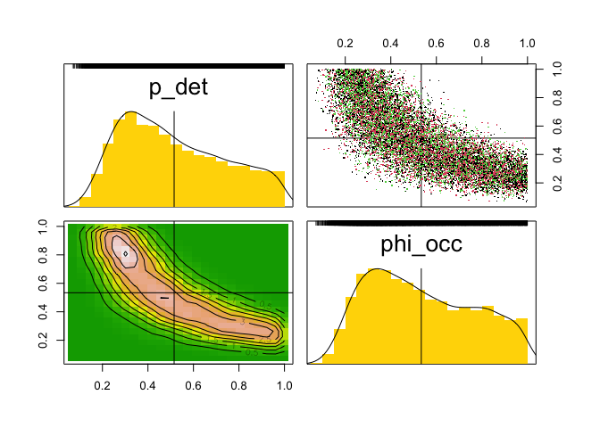
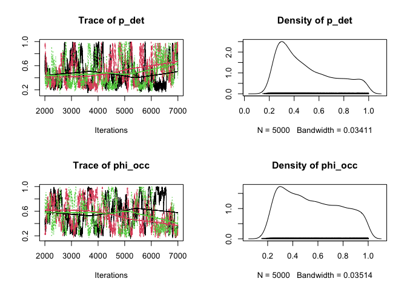
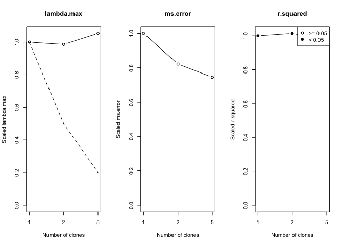
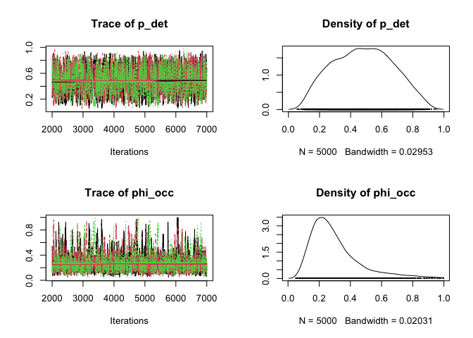
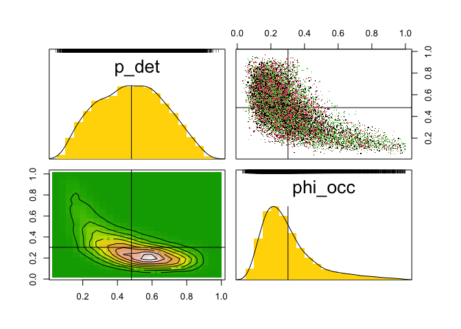
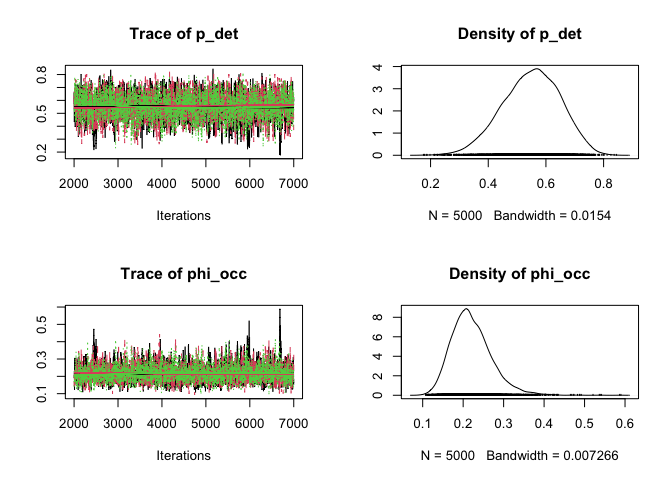
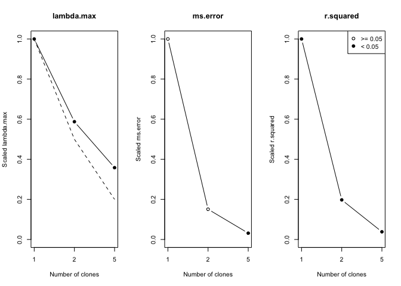

Random effects models and data cloning
================

## Introduction

In the previous part, we reviewed the basic statistical concepts behind
the likelihood inference and the Bayesian inference. We looked at how to
write a JAGS model function for some linear and generalized linear
regression models and use it in the package ‘dclone’ to get the Bayesian
credible intervals as well as the frequentist confidence intervals based
on the asymptotic normal distribution. We also discussed some of the
reasons to use the MCMC approach to conducting statistical inference,
either Bayesian or frequentist.

We will now generalize the models to make them relevant to some complex
practical situations. These are some of the situations where the
analytical approaches to Bayesian and likelihood inference are difficult
to impossible to implement. The question of estimability of the
parameters becomes much more relevant but difficult to diagnose. The
method of data cloning is particularly useful for diagnosing
estimability of the parameters. You will notice that, although the
models are much more complex, the coding component does not increase in
complexity. We will also discuss prediction of missing data.

## Detection error in occupancy studies (latent variables)

Let us revisit the occupancy model again. In practice, the assumption
that you observe the occupancy status correctly is somewhat suspect. For
example, if we are looking for a bird species, if the bird never sings
or gives some sort of a cue, it is extremely difficult to know if they
are there. Hence, even if the species is present, we may make an error
and note that it is not present. This is called ‘detection error’. How
can we model this?

Let  denote the
true status of the *i*-th cell. So in our previous notation, now
=\phi").
The observed value, generally denoted by
 could be 1 or 0
depending on the true status. If we assume that the species are never
misidentified, then we can write
=p")
and
=1-p").
Moreover,
=1").
In principle, we can also have misidentification. For example, a coyote
could be mistaken for a wolf. But we will not discuss it here. It is a
fairly simple extension of this model. Probability of detection is
 and probability of
occupancy is
. How can we
infer about these given the data?

Notice that we only observe
’s and not the
’s. *The
unobserved variable
 is called a
latent variable.*

To write down the likelihood function, we need to compute the
distribution of the observed data
. We can see that
=p \phi")
and
=(1-p) \phi").
We can write down the likelihood based on this. However, we are going to
write this as a hierarchical model.

Let us modify the previous code to see how this inference proceeds.

``` r
library(dclone)
```

    ## Loading required package: coda

    ## Loading required package: parallel

    ## Loading required package: Matrix

    ## dclone 2.3-1      2023-04-07

``` r
phi.true = 0.3 # occupancy
p.true = 0.7   # detectability
n = 30         # sample size
W = rbinom(n, 1 ,phi.true)   # true status
Y = rbinom(n, 1, W * p.true) # detections
```

### Bayesian inference using JAGS and dclone

Step 1: WE need to define the model function. This is the critical
component.

``` r
Occ.model = function(){
  # Likelihood: Latent variables are random variables.
  for (i in 1:n){
    W[i] ~ dbin(phi_occ, 1)
    Y[i] ~ dbin(W[i] * p_det, 1)
  }
  # Priors
  phi_occ ~ dbeta(1, 1)
  p_det ~ dbeta(1, 1)
}
```

Now we need to provide the data to the model and generate random numbers
from the posterior. We will discuss different options later.

``` r
dat = list(Y=Y, n=n)
```

Following command will not work. But try it by removing the comments
hash to see what happens.

``` r
Occ.Bayes = jags.fit(data=dat, params=c("phi_occ","p_det"), model=Occ.model)
```

    ## Registered S3 method overwritten by 'R2WinBUGS':
    ##   method            from  
    ##   as.mcmc.list.bugs dclone

    ## Compiling model graph
    ##    Resolving undeclared variables
    ##    Allocating nodes
    ## Graph information:
    ##    Observed stochastic nodes: 30
    ##    Unobserved stochastic nodes: 32
    ##    Total graph size: 94
    ## 
    ## Initializing model
    ## Deleting model

    ## Error in rjags::jags.model(model, data, n.chains = n.chains, n.adapt = n.adapt, : Error in node Y[1]
    ## Node inconsistent with parents

This did not quite work. When there are latent variables, many times, we
have to start the process at the appropriate initial values.

``` r
ini = list(W=rep(1, n)) 
Occ.Bayes = jags.fit(data=dat, params=c("phi_occ","p_det"), model = Occ.model,
    inits=ini)
```

    ## Compiling model graph
    ##    Resolving undeclared variables
    ##    Allocating nodes
    ## Graph information:
    ##    Observed stochastic nodes: 30
    ##    Unobserved stochastic nodes: 32
    ##    Total graph size: 94
    ## 
    ## Initializing model

``` r
summary(Occ.Bayes)
```

    ## 
    ## Iterations = 2001:7000
    ## Thinning interval = 1 
    ## Number of chains = 3 
    ## Sample size per chain = 5000 
    ## 
    ## 1. Empirical mean and standard deviation for each variable,
    ##    plus standard error of the mean:
    ## 
    ##           Mean     SD Naive SE Time-series SE
    ## p_det   0.5151 0.2272 0.001855       0.009616
    ## phi_occ 0.5337 0.2309 0.001885       0.011274
    ## 
    ## 2. Quantiles for each variable:
    ## 
    ##           2.5%    25%    50%    75%  97.5%
    ## p_det   0.1762 0.3270 0.4751 0.6895 0.9670
    ## phi_occ 0.1799 0.3402 0.5011 0.7238 0.9693

``` r
plot(Occ.Bayes)
```

<!-- -->

This seems to work quite well! But our answers are quite weird (We know
the truth!). Let us plot the two dimensional (joint) distribution of the
parameters.

``` r
pairs(Occ.Bayes)
```

<!-- -->

This suggests that the posterior distribution is banana shaped. But just
looking at these plots, we cannot say for sure if our answers are
correct or not.

Should we, then, accept the answers? Not so fast. Let us look at the
model again. It is clear that we can estimate the product

given the data. But decomposing this product in
 and
 is
impossible. This is called ‘non-estimability’.

In this case, this also is non-identifiability. There are several
combinations of  and
 that lead to
the same
 and
hence the same distribution of the observed data. Such situations are
not uncommon when dealing with the hiearchical models in general, and
measurement error models in particular.

We should not make any inferences about the probability of occupancy
based on these data. You can change the priors and see what happens to
the posteriors. You might find it interesting and educational.

**Non-estimability: If there are two or more values in the parameter
space that lead to identical likelihood value, such values are called
‘non-estimable’.**

Note: You may recall from the linear regression that if the covariates
are perfectly correlated with each other, the regression coefficients
are non-estimable. If covariate
 is perfectly
correlated with ,
these covariates separately give no additional information.

### Bayesian result and its data cloning version

If the posterior distribution converges to a non-degenerate distribution
as the sample size increases, it implies that set of parameters is
non-estimable.

If the posterior distribution converges to a non-degenerate distribution
as the number of clones increases, it implies that set of parameters is
non-estimable.

An immediate consequence of this result is that the variance of the
posterior distribution does not converge to 0 (instead it converges to
some positive number).

Let us modify our data cloning code to see what happens.

``` r
Occ.model.dc = function(){
  # Likelihood 
  for(k in 1:ncl){
    for (i in 1:n){
        W[i,k] ~ dbin(phi_occ, 1)
        Y[i,k] ~ dbin(W[i,k] * p_det, 1)
    }
  }
  # Prior
  phi_occ ~ dbeta(1, 1)
  p_det ~ dbeta(1, 1)
}
```

We need to turn the original data into an array. And we need to add
another index `ncl` for the cloned dimension. It gets multiplied by the
number of clones.

``` r
Y = array(Y, dim=c(n, 1))
Y = dcdim(Y)
dat = list(Y=Y, n=n, ncl=1)
```

As previously, we need to initiate the `W`’s.

``` r
ini = list(W=array(rep(1, n), dim=c(n, 1)))
```

We need to clone these initial values as well. You should always check
if this is doing the right job.

``` r
initfn = function(model, n.clones){
  W=array(rep(1, n), dim=c(n, 1))
  list(W=dclone(dcdim(W), n.clones))
}
initfn(n.clones=2)
```

    ## $W
    ##       clone.1 clone.2
    ##  [1,]       1       1
    ##  [2,]       1       1
    ##  [3,]       1       1
    ##  [4,]       1       1
    ##  [5,]       1       1
    ##  [6,]       1       1
    ##  [7,]       1       1
    ##  [8,]       1       1
    ##  [9,]       1       1
    ## [10,]       1       1
    ## [11,]       1       1
    ## [12,]       1       1
    ## [13,]       1       1
    ## [14,]       1       1
    ## [15,]       1       1
    ## [16,]       1       1
    ## [17,]       1       1
    ## [18,]       1       1
    ## [19,]       1       1
    ## [20,]       1       1
    ## [21,]       1       1
    ## [22,]       1       1
    ## [23,]       1       1
    ## [24,]       1       1
    ## [25,]       1       1
    ## [26,]       1       1
    ## [27,]       1       1
    ## [28,]       1       1
    ## [29,]       1       1
    ## [30,]       1       1
    ## attr(,"n.clones")
    ## [1] 2
    ## attr(,"n.clones")attr(,"method")
    ## [1] "dim"
    ## attr(,"n.clones")attr(,"method")attr(,"drop")
    ## [1] TRUE

Let’s run data cloning.

``` r
Occ.DC = dc.fit(data=dat, params=c("phi_occ","p_det"), model=Occ.model.dc,
    n.clones=c(1, 2, 5), unchanged="n", multiply="ncl",
    inits=ini, initsfun=initfn)
```

    ## 
    ## Fitting model with 1 clone 
    ## 
    ## Compiling model graph
    ##    Resolving undeclared variables
    ##    Allocating nodes
    ## Graph information:
    ##    Observed stochastic nodes: 30
    ##    Unobserved stochastic nodes: 32
    ##    Total graph size: 95
    ## 
    ## Initializing model
    ## 
    ## 
    ## Fitting model with 2 clones 
    ## 
    ## Compiling model graph
    ##    Resolving undeclared variables
    ##    Allocating nodes
    ## Graph information:
    ##    Observed stochastic nodes: 60
    ##    Unobserved stochastic nodes: 62
    ##    Total graph size: 185
    ## 
    ## Initializing model
    ## 
    ## 
    ## Fitting model with 5 clones 
    ## 
    ## Compiling model graph
    ##    Resolving undeclared variables
    ##    Allocating nodes
    ## Graph information:
    ##    Observed stochastic nodes: 150
    ##    Unobserved stochastic nodes: 152
    ##    Total graph size: 455
    ## 
    ## Initializing model

``` r
summary(Occ.DC)
```

    ## 
    ## Iterations = 2001:7000
    ## Thinning interval = 1 
    ## Number of chains = 3 
    ## Sample size per chain = 5000 
    ## Number of clones = 5
    ## 
    ## 1. Empirical mean and standard deviation for each variable,
    ##    plus standard error of the mean:
    ## 
    ##           Mean     SD  DC SD Naive SE Time-series SE R hat
    ## p_det   0.4981 0.2202 0.4924 0.001798        0.01934 1.025
    ## phi_occ 0.5582 0.2268 0.5072 0.001852        0.02426 1.042
    ## 
    ## 2. Quantiles for each variable:
    ## 
    ##           2.5%    25%    50%    75%  97.5%
    ## p_det   0.2177 0.3142 0.4388 0.6540 0.9622
    ## phi_occ 0.2227 0.3583 0.5332 0.7485 0.9735

``` r
plot(Occ.DC)
```

<!-- -->

``` r
pairs(Occ.DC)
```

<!-- -->

There are a couple of diagnostic tools available in ‘dclone’ for the
non-estimability issue.

``` r
dcdiag(Occ.DC)
```

    ##   n.clones lambda.max  ms.error  r.squared    r.hat
    ## 1        1 0.08999909 0.2401173 0.02177118 1.012580
    ## 2        2 0.08874350 0.1972214 0.02208530 1.026601
    ## 3        5 0.09483718 0.1788158 0.02119207 1.042230

``` r
dcdiag(Occ.DC) |> plot()
```

<!-- -->

1.  Check if the `lambda.max` is converging to zero. The rate at which
    this converges to zero should be approximately 1/*K*.
2.  If the variance is converging to 0 but the rate is different than
    1/*K*, it implies the asymptotics is of a different order. If you
    find such an example in your work, please let me know.
3.  Check the pairs plot to see if the likelihood function is converging
    to a manifold instead of a single point.

**Availability of the estimability diagnostics is one of the most
important features of data cloning. It will warn you if your scientific
inferences could be misleading.**

If the parameters are non-estimable, the only recourse one has is to
change the model (add assumptions or collect different kind of data).
There is always a possibility that, although the full parameter space
may not be estimable, a function of the parameter might be estimable. If
such a function is also of scientific interest, we can safely conduct
scientific inferences based on estimates of such a function of the
parameters.

### Replicate surveys

Suppose we visit the same cell several times. Assume that the visits are
independent of each other and the true occupancy status remains the same
throughout these surveys, then we can estimate the parameters. The model
can be written as a hierarchical model:

- Hierarchy 1:
  ")
- Hierarchy 2:
  ")

Notice that hierarchy 2 depends on hierarchy 1 result.

We can easily modify the earlier code to allow for multiple surveys. We
will do such a modification with two surveys for each cell.

``` r
phi.true = 0.3
p.true = 0.7
n = 30
v = 2 # number of visits
W = rbinom(n, 1, phi.true)
Y = NULL
for (j in 1:v)
    Y <- cbind(Y, rbinom(n, 1, W * p.true))
```

### Bayesian inference using JAGS and dclone

Step 1: we need to define the model function.

``` r
Occ.model = function(){
  # Likelihood: Latent variables are random variables.
  for (i in 1:n){
    W[i] ~ dbin(phi_occ, 1)
    for (j in 1:v){
        Y[i,j] ~ dbin(W[i] * p_det, 1)}
  }
  # Priors
  phi_occ ~ dbeta(1, 1)
  p_det ~ dbeta(1, 1)
}
```

Now we need to provide the data to the model and generate random numbers
from the posterior. We will discuss different options later.

``` r
dat = list(Y=Y, n=n, v=v)
ini = list(W=rep(1, n))

Occ.Bayes = jags.fit(data=dat, params=c("phi_occ","p_det"), model=Occ.model,
    inits=ini)
```

    ## Compiling model graph
    ##    Resolving undeclared variables
    ##    Allocating nodes
    ## Graph information:
    ##    Observed stochastic nodes: 60
    ##    Unobserved stochastic nodes: 32
    ##    Total graph size: 125
    ## 
    ## Initializing model

``` r
summary(Occ.Bayes)
```

    ## 
    ## Iterations = 2001:7000
    ## Thinning interval = 1 
    ## Number of chains = 3 
    ## Sample size per chain = 5000 
    ## 
    ## 1. Empirical mean and standard deviation for each variable,
    ##    plus standard error of the mean:
    ## 
    ##           Mean     SD Naive SE Time-series SE
    ## p_det   0.4809 0.1906 0.001556       0.005483
    ## phi_occ 0.3018 0.1634 0.001334       0.006097
    ## 
    ## 2. Quantiles for each variable:
    ## 
    ##            2.5%    25%    50%    75%  97.5%
    ## p_det   0.14061 0.3313 0.4816 0.6242 0.8370
    ## phi_occ 0.09793 0.1894 0.2617 0.3651 0.7624

``` r
plot(Occ.Bayes)
```

<!-- -->

``` r
pairs(Occ.Bayes)
```

<!-- -->

These are nice unimodal posterior distributions.

We can modify the data cloning code to check if the parameters are, in
fact, estimable.

``` r
Occ.model.dc = function(){
  # Likelihood
  for(k in 1:ncl){
    for (i in 1:n){
      W[i,k] ~ dbin(phi_occ, 1)
      for (j in 1:v){
        Y[i,j,k] ~ dbin(W[i,k] * p_det, 1)
      }
    }
  }
  # Prior
  phi_occ ~ dbeta(1, 1)
  p_det ~ dbeta(1, 1)
}
```

We need to turn the original data into an array. And we need to add
another index `ncl` for the cloned dimension. It gets multiplied by the
number of clones.

``` r
Y = array(Y, dim=c(n,v,1))
Y = dcdim(Y)
dat = list(Y=Y, n=n, v=v, ncl=1)

# As previously, we need to initiate the W's. 
ini = list(W=array(rep(1, n), dim=c(n, 1)))
# We need to clone these initial values as well. You should always check if this is doing the right job.
initfn =function(model, n.clones){
  W=array(rep(1,n), dim=c(n,1))
  list(W=dclone(dcdim(W), n.clones))
}
Occ.DC = dc.fit(data=dat, params=c("phi_occ","p_det"), model=Occ.model.dc,
    n.clones=c(1, 2, 5),
    unchanged=c("n","v"), multiply="ncl",
    inits=ini, initsfun=initfn)
```

    ## 
    ## Fitting model with 1 clone 
    ## 
    ## Compiling model graph
    ##    Resolving undeclared variables
    ##    Allocating nodes
    ## Graph information:
    ##    Observed stochastic nodes: 60
    ##    Unobserved stochastic nodes: 32
    ##    Total graph size: 126
    ## 
    ## Initializing model
    ## 
    ## 
    ## Fitting model with 2 clones 
    ## 
    ## Compiling model graph
    ##    Resolving undeclared variables
    ##    Allocating nodes
    ## Graph information:
    ##    Observed stochastic nodes: 120
    ##    Unobserved stochastic nodes: 62
    ##    Total graph size: 246
    ## 
    ## Initializing model
    ## 
    ## 
    ## Fitting model with 5 clones 
    ## 
    ## Compiling model graph
    ##    Resolving undeclared variables
    ##    Allocating nodes
    ## Graph information:
    ##    Observed stochastic nodes: 300
    ##    Unobserved stochastic nodes: 152
    ##    Total graph size: 606
    ## 
    ## Initializing model

``` r
summary(Occ.DC)
```

    ## 
    ## Iterations = 2001:7000
    ## Thinning interval = 1 
    ## Number of chains = 3 
    ## Sample size per chain = 5000 
    ## Number of clones = 5
    ## 
    ## 1. Empirical mean and standard deviation for each variable,
    ##    plus standard error of the mean:
    ## 
    ##           Mean      SD  DC SD  Naive SE Time-series SE R hat
    ## p_det   0.5490 0.09941 0.2223 0.0008117       0.002277 1.005
    ## phi_occ 0.2207 0.04961 0.1109 0.0004051       0.001191 1.007
    ## 
    ## 2. Quantiles for each variable:
    ## 
    ##           2.5%    25%    50%    75%  97.5%
    ## p_det   0.3450 0.4822 0.5536 0.6204 0.7292
    ## phi_occ 0.1397 0.1862 0.2150 0.2491 0.3341

``` r
plot(Occ.DC)
```

<!-- -->

``` r
pairs(Occ.DC)
```

<!-- -->

``` r
dcdiag(Occ.DC)
```

    ##   n.clones lambda.max  ms.error  r.squared    r.hat
    ## 1        1 0.04664598 0.6283849 0.08100921 1.003439
    ## 2        2 0.02751645 2.4216953 0.21045098 1.009831
    ## 3        5 0.01082814 0.4888196 0.08171408 1.005934

``` r
plot(dcdiag(Occ.DC))
```

<!-- -->

## Random effects in regression: Why and when?

We have shown how hierarchical models can be used to deal with
measurement error. Now we will look at a few examples where we use them
to combine data across several studies.

We will start with a simple (but extremely important) example that
started the entire field of mixture as well as hierarchical models
(Neyman and Scott, 1949).

Researchers in animal husbandary wanted to know how to improve the stock
of animals such as milk cows and bulls. This played an important role in
the ‘white revolution’ that lead to improving the nutrition in many
countries. Following is a somewhat made up and highly simplified
situation.

Suppose we have *n* cows. We want to know which cows have good genetic
potential that can be passed on to the next generation. Each cow might
have only a few calves. We measure the amount of milk by each calf.

Let  be the
amount of milk produced by the j-th calf of the i-th cow. We can
consider a linear model that uses the ‘cow effect’ (genetic) and
‘environmental effect’ to explain the amount of milk. This is same as
one way ANOVA model.


Under the usual Gaussian error structure, we know that

")
where

and 
().

There are 
observations and
 parameters. The
number of parameters increases at the same rate as the number of
observations. Note that the ratio of parameters to observations
converges to 0.5. Roughly speaking, for the MLE to work, this ratio
needs to go to 0. Generally the number of parameters is fixed and hence
this condition is satisfied.

We simply do not have much information about each
 as there
are only two observations corresponding to it. It also turns out that
the ML estimator of

converges to
.
Hence it is not consistent even though the number of observations
corresponding to it do converge to infinity. This was a major blow to
the theory of maximum likelihood. Although it turns out Fisher had
implicitly answered it a decade before this paper.

How can we reduce the number of parameters?

1.  If there are covariates such as weight of the mother, mother’s milk
    production are available, we can model
    .
2.  Suppose covariates are not available or difficult to assess what to
    use as a covariate. If we assume that cows are kind of similar to
    each other, then we can assume that they come from a population of
    cows such that
    ").
    It turns out, under such an assumption, we can estimate the
    parameters
    ")
    consistently.

This model is a hierarchical model.

- Hierarchy 1:
  ")
- Hierarchy 2:
  ")

For a Bayesian approach, we put priors on the three parameters. This
forms the third hierarchy.

This simple model can be used in many different situations.

1.  Measurement error in covariates in regression
2.  Random intercept regression model to account for missing covariates
3.  Kalman filter models for time series with measurement error are of
    the same kind with a bit more complexity as we will see the third
    part.

Let us see what makes it a difficult model to analyze using the
likelihood approach.

In order to write down the likelihood function, we need to compute the
marginal distribution of the observations. Remember
 are not
observed. Hence we have to integrate over them.

=\int f(y_{ij}|\mu_{i})g(\mu_{i})d\mu_{i}")

Again, this is not a precise statement but it gives you the idea. This
integral is one dimensional and hence can be computed analytically and
also numerically. However, in many cases the dimension of the integral
is quite large and hence neither of these solutions are available. In
some cases, one can obtain Laplace approximation to this integral (INLA
and related methods rely on this approximation). The most general
approach is based on the MCMC algorithm.

``` r
n = 30
mu_true = 2
tau_true = 0.5
sigma_true = 1

mu = rnorm(n, mu_true, tau_true)
Y = cbind(
    rnorm(n, mu, sigma_true),
    rnorm(n, mu, sigma_true))
```

We will write the Bayesian model first. Remember the normal distribution
is defined in terms of the precision (inverse of the variance).

``` r
LM_Bayes = function(){
  # Likelihood
  for (i in 1:n){
    mu[i] ~ dnorm(mu.t, prec_tau)
    for (j in 1:2){
      Y[i,j] ~ dnorm(mu[i], prec_sigma)
    }
  }
  # Priors
  mu.t ~ dnorm(0, 0.01)
  prec_tau ~ dgamma(0.1, 0.1)
  prec_sigma ~ dgamma(0.1, 0.1)
  # Parameters on the natural scale
  tau <- sqrt(1/prec_tau)
  sigma <- sqrt(1/prec_sigma)
}
```

Data in array form for data cloning purpose

``` r
Y = as.array(Y, dim=c(n,2,1))
Y = dcdim(Y)

dat = list(Y=Y, n=n)
LM_Bayes_fit = jags.fit(data=dat, params=c("mu.t","tau","sigma"), model=LM_Bayes)
```

    ## Compiling model graph
    ##    Resolving undeclared variables
    ##    Allocating nodes
    ## Graph information:
    ##    Observed stochastic nodes: 60
    ##    Unobserved stochastic nodes: 33
    ##    Total graph size: 102
    ## 
    ## Initializing model

``` r
summary(LM_Bayes_fit)
```

    ## 
    ## Iterations = 1001:6000
    ## Thinning interval = 1 
    ## Number of chains = 3 
    ## Sample size per chain = 5000 
    ## 
    ## 1. Empirical mean and standard deviation for each variable,
    ##    plus standard error of the mean:
    ## 
    ##         Mean     SD  Naive SE Time-series SE
    ## mu.t  1.9335 0.1486 0.0012130       0.003007
    ## sigma 0.9262 0.1040 0.0008491       0.001376
    ## tau   0.4562 0.1505 0.0012292       0.004093
    ## 
    ## 2. Quantiles for each variable:
    ## 
    ##         2.5%    25%    50%    75%  97.5%
    ## mu.t  1.6417 1.8352 1.9328 2.0297 2.2265
    ## sigma 0.7405 0.8527 0.9219 0.9911 1.1463
    ## tau   0.2080 0.3455 0.4441 0.5494 0.7848

We will modify it to do data cloning. This is useful to assure us that
the parameters are estimable. It is also important for making it
invariant to the choice of the priors and parameterization.

``` r
LM_DC = function(){
  # Likelihood
  for (k in 1:ncl){
    for (i in 1:n){
      mu[i,k] ~ dnorm(mu.t, prec_tau)
      for (j in 1:2){
        Y[i,j,k] ~ dnorm(mu[i,k], prec_sigma)
      }
    }
  }
  # Priors
  mu.t ~ dnorm(0, 0.01)
  prec_tau ~ dgamma(0.1, 0.1)
  prec_sigma ~ dgamma(0.1, 0.1)
  # Parameters on the natural scale
  tau <- sqrt(1/prec_tau)
  sigma <- sqrt(1/prec_sigma)
}
```

Data in array form for data cloning purpose.

``` r
Y = array(Y, dim=c(n,2,1))
Y = dcdim(Y)

dat = list(Y=Y, n=n, ncl=1)
LM_DC_fit = dc.fit(data=dat, params=c("mu.t","tau","sigma"), model=LM_DC,
    n.clones=c(1, 2, 5), unchanged="n", multiply="ncl")
```

    ## 
    ## Fitting model with 1 clone 
    ## 
    ## Compiling model graph
    ##    Resolving undeclared variables
    ##    Allocating nodes
    ## Graph information:
    ##    Observed stochastic nodes: 60
    ##    Unobserved stochastic nodes: 33
    ##    Total graph size: 103
    ## 
    ## Initializing model
    ## 
    ## 
    ## Fitting model with 2 clones 
    ## 
    ## Compiling model graph
    ##    Resolving undeclared variables
    ##    Allocating nodes
    ## Graph information:
    ##    Observed stochastic nodes: 120
    ##    Unobserved stochastic nodes: 63
    ##    Total graph size: 193
    ## 
    ## Initializing model
    ## 
    ## 
    ## Fitting model with 5 clones 
    ## 
    ## Compiling model graph
    ##    Resolving undeclared variables
    ##    Allocating nodes
    ## Graph information:
    ##    Observed stochastic nodes: 300
    ##    Unobserved stochastic nodes: 153
    ##    Total graph size: 463
    ## 
    ## Initializing model

``` r
summary(LM_DC_fit)
```

    ## 
    ## Iterations = 1001:6000
    ## Thinning interval = 1 
    ## Number of chains = 3 
    ## Sample size per chain = 5000 
    ## Number of clones = 5
    ## 
    ## 1. Empirical mean and standard deviation for each variable,
    ##    plus standard error of the mean:
    ## 
    ##         Mean      SD  DC SD  Naive SE Time-series SE R hat
    ## mu.t  1.9373 0.06283 0.1405 0.0005130       0.001415 1.002
    ## sigma 0.9282 0.04902 0.1096 0.0004002       0.001219 1.001
    ## tau   0.3763 0.09082 0.2031 0.0007415       0.004514 1.005
    ## 
    ## 2. Quantiles for each variable:
    ## 
    ##         2.5%    25%    50%    75%  97.5%
    ## mu.t  1.8160 1.8943 1.9368 1.9801 2.0601
    ## sigma 0.8343 0.8947 0.9278 0.9608 1.0260
    ## tau   0.2083 0.3101 0.3761 0.4406 0.5526

``` r
pairs(LM_DC_fit)
```

<!-- -->

``` r
dcdiag(LM_DC_fit)
```

    ##   n.clones  lambda.max   ms.error   r.squared    r.hat
    ## 1        1 0.025016214 0.43642416 0.047753829 1.004067
    ## 2        2 0.014692290 0.06579741 0.009428430 1.001947
    ## 3        5 0.008960959 0.01376262 0.001830729 1.004501

``` r
plot(dcdiag(LM_DC_fit))
```

<!-- -->

The best thing about the MCMC approach is that we can modify the
prototype program to do Generalized linear mixed models.

Let us see how we can change the program to do Poisson regression with
random intercepts. This is useful for accounting for missing covariates
in the usual Poisson regression. This can also be used to account for
site effect in abundance surveys.

Mathematically the model is:

- Hierarchy 1:
  \sim N(log(\lambda),\tau^{2})")
- Hierarchy 2:
  ")

``` r
n = 30
mu_true = 2
tau_true = 0.5
sigma_true = 1

mu = rnorm(n, mu_true, tau_true)
Y = rpois(n, exp(mu))
```

We will write the Bayesian model first. Remember the normal distribution
is defined in terms of the precision (inverse of the variance).

``` r
GLMM_Bayes = function(){
  # Likelihood
  for (i in 1:n){
    mu[i] ~ dnorm(mu.t, prec_tau)
    Y[i] ~ dpois(exp(mu[i]))
  }
  # Priors
  mu.t ~ dnorm(0, 0.01)
  prec_tau ~ dgamma(0.1, 0.1)
  # Parameters on the natural scale
  tau <- sqrt(1/prec_tau)
  lambda <- exp(mu.t)
}

dat = list(Y=Y, n=n)
GLMM_Bayes_fit = jags.fit(data=dat, params=c("lambda","tau"), model=GLMM_Bayes)
```

    ## Compiling model graph
    ##    Resolving undeclared variables
    ##    Allocating nodes
    ## Graph information:
    ##    Observed stochastic nodes: 30
    ##    Unobserved stochastic nodes: 32
    ##    Total graph size: 100
    ## 
    ## Initializing model

``` r
summary(GLMM_Bayes_fit)
```

    ## 
    ## Iterations = 2001:7000
    ## Thinning interval = 1 
    ## Number of chains = 3 
    ## Sample size per chain = 5000 
    ## 
    ## 1. Empirical mean and standard deviation for each variable,
    ##    plus standard error of the mean:
    ## 
    ##          Mean     SD  Naive SE Time-series SE
    ## lambda 7.0957 0.8809 0.0071925       0.012223
    ## tau    0.5326 0.1075 0.0008777       0.002013
    ## 
    ## 2. Quantiles for each variable:
    ## 
    ##          2.5%    25%    50%    75%  97.5%
    ## lambda 5.4448 6.4968 7.0643 7.6645 8.8950
    ## tau    0.3478 0.4568 0.5235 0.5988 0.7681

As usual, we can turn the crank for data cloning to check the
estimability of the parameters.

``` r
GLMM_DC = function(){
  # Likelihood
  for (k in 1:ncl){
    for (i in 1:n){
      mu[i,k] ~ dnorm(mu.t,prec_tau)
      Y[i,k] ~ dpois(exp(mu[i,k]))
    }
  }
  # Priors
  mu.t ~ dnorm(0, 0.01)
  prec_tau ~ dgamma(0.1, 0.1)
  # Parameters on the natural scale
  tau <- sqrt(1/prec_tau)
  lambda <- exp(mu.t)
}

# Data in array form for data cloning purpose

Y = array(Y, dim=c(n,1))
Y = dcdim(Y)

dat = list(Y=Y, n=n, ncl=1)
GLMM_DC_fit = dc.fit(data=dat, params=c("lambda","tau"), model=GLMM_DC,
    n.clones=c(1, 2, 5), unchanged="n", multiply="ncl")
```

    ## 
    ## Fitting model with 1 clone 
    ## 
    ## Compiling model graph
    ##    Resolving undeclared variables
    ##    Allocating nodes
    ## Graph information:
    ##    Observed stochastic nodes: 30
    ##    Unobserved stochastic nodes: 32
    ##    Total graph size: 101
    ## 
    ## Initializing model
    ## 
    ## 
    ## Fitting model with 2 clones 
    ## 
    ## Compiling model graph
    ##    Resolving undeclared variables
    ##    Allocating nodes
    ## Graph information:
    ##    Observed stochastic nodes: 60
    ##    Unobserved stochastic nodes: 62
    ##    Total graph size: 191
    ## 
    ## Initializing model
    ## 
    ## 
    ## Fitting model with 5 clones 
    ## 
    ## Compiling model graph
    ##    Resolving undeclared variables
    ##    Allocating nodes
    ## Graph information:
    ##    Observed stochastic nodes: 150
    ##    Unobserved stochastic nodes: 152
    ##    Total graph size: 461
    ## 
    ## Initializing model

``` r
summary(GLMM_DC_fit)
```

    ## 
    ## Iterations = 2001:7000
    ## Thinning interval = 1 
    ## Number of chains = 3 
    ## Sample size per chain = 5000 
    ## Number of clones = 5
    ## 
    ## 1. Empirical mean and standard deviation for each variable,
    ##    plus standard error of the mean:
    ## 
    ##          Mean      SD  DC SD  Naive SE Time-series SE R hat
    ## lambda 7.0868 0.37301 0.8341 0.0030456      0.0049183 1.002
    ## tau    0.5076 0.04621 0.1033 0.0003773      0.0008546 1.003
    ## 
    ## 2. Quantiles for each variable:
    ## 
    ##          2.5%    25%   50%    75%  97.5%
    ## lambda 6.3538 6.8360 7.085 7.3382 7.8254
    ## tau    0.4219 0.4758 0.506 0.5375 0.6028

``` r
exp(mu_true)
```

    ## [1] 7.389056

``` r
tau_true
```

    ## [1] 0.5

### Estimating the effect of a treatment from multi-center clinical trials

In clinical trials, we are interested in estimating the effect of the
treatment. One of the simplest forms of clinical trial is where we split
a group of patients in two groups randomly. One of the group gets the
treatment and the other gets a placebo.

We can then estimate the difference in the outcomes. This may be done
using a simple t-test if the outcome is a continuous measurement. If the
patients are quite different from each other in terms of say age, blood
pressure or some such physical characteristics that may affect the
outcome, we adjust them by using a regression approach. We include these
other covariates and the treatment/control indicator variable in the
model. The effect of the treatment after adjusting for other covariates
can be studied using such a regression model.

Often in practice, we may not have access to such covariates. Using
random intercept model in regression is one way out of such a situation.
In this case, we do consider the differences between patients but
without ascribing them to any specific, known values of the covariates.
The model one may consider is:

}+\epsilon_{i}")

As we have seen in the previous example (Neyman-Scott problem), this
model is non-estimable. One way to make it estimable is by using a
hierarchical structure:

Hierarchy 2:
")

Homework: Check the validity of the following statement without doing
any mathematics. You can use data cloning to do that.

This leads to estimability for
, the
parameter of interest. Although it does not lead to estimation of the
variances
").

> An approach not described in this course: We can use profile
> likelihood for the parameter
> . This
> eliminates the ‘nuisance parameters’
> .
> Computing the profile likelihood and quantification of uncertainty for
> inferences based on it for hierarchical models can be tackled using
> data cloning. This could be another course!

Suppose the outcome is binary, survival for 5 years vs. failure before 5
years. In this case, a convenient model is a binary regression model
such as a Logistic regression model.

Hierarchy 1:

=\frac{exp(\beta_{0i}+\beta I_{(Treatment)})}{1+exp(\beta_{0i}+\beta I_{(Treatment)})}")

Hierarchy 2:
")

This is an example of a Generalized Linear Mixed Model. Fortunately, for
this model all parameters are estimable as we will see using data
cloning. The random intercept here could be accounting for differences
in the clinical centers (hospitals), assuming we have only two patients,
one in control and one in the treatment group. If we have multiple
patients in each group, we may include another random effect to account
for differences in the patients within each group. For example, we may
consider a model:

Hierarchy 1:

=\frac{exp(\beta_{0i}+\beta I_{(Treatment)}+\beta_{1j})}{1+exp(\beta_{0i}+\beta I_{(Treatment)}+\beta_{1j})}")

Hierarchy 2:
"),
")

We can include interactions between random effects and so on. We will
not go into these complex models in this course.

Let us see how one can modify the prototype program to analyze the
random intercept Logistic regression model.

Each center has one control and one treatment patient.

``` r
n = 300      # Number of clinical centers
mu_true = 0
tau_true = 0.5
delta = 1   # Treatment effect
mu = rnorm(n, mu_true, tau_true)
Y = cbind(
    rbinom(n, 1, plogis(mu)),
    rbinom(n, 1, plogis(mu+delta)))
```

We will write the Bayesian model first. Remember the normal distribution
is defined in terms of the precision (inverse of the variance).

``` r
GLMM_Bayes = function(){
  # Likelihood
  for (i in 1:n){
    mu[i] ~ dnorm(mu.t,prec_tau)
    Y[i,1] ~ dbin(ilogit(mu[i]),1)
    Y[i,2] ~ dbin(ilogit(mu[i]+delta),1)
  }
  # Priors
  mu.t ~ dnorm(0, 0.01)
  prec_tau ~ dgamma(0.1, 0.1)
  delta ~ dnorm(0, 0.1)
  # Parameters on the natural scale
  tau <- sqrt(1/prec_tau)
}

dat = list(Y=Y, n=n)
GLMM_Bayes_fit = jags.fit(data=dat, params=c("delta","mu.t","tau"), model=GLMM_Bayes)
```

    ## Compiling model graph
    ##    Resolving undeclared variables
    ##    Allocating nodes
    ## Graph information:
    ##    Observed stochastic nodes: 600
    ##    Unobserved stochastic nodes: 303
    ##    Total graph size: 1810
    ## 
    ## Initializing model

``` r
summary(GLMM_Bayes_fit)
```

    ## 
    ## Iterations = 2001:7000
    ## Thinning interval = 1 
    ## Number of chains = 3 
    ## Sample size per chain = 5000 
    ## 
    ## 1. Empirical mean and standard deviation for each variable,
    ##    plus standard error of the mean:
    ## 
    ##          Mean     SD Naive SE Time-series SE
    ## delta 1.04916 0.1899 0.001551       0.007083
    ## mu.t  0.06138 0.1268 0.001036       0.005705
    ## tau   0.64141 0.2412 0.001969       0.030434
    ## 
    ## 2. Quantiles for each variable:
    ## 
    ##          2.5%     25%     50%    75%  97.5%
    ## delta  0.6889  0.9179 1.04396 1.1781 1.4257
    ## mu.t  -0.1898 -0.0211 0.06136 0.1429 0.3128
    ## tau    0.2275  0.4582 0.63025 0.8038 1.1450

We will modify this to get the MLE using data cloning.

``` r
GLMM_DC = function(){
  # Likelihood
  for (k in 1:ncl){
    for (i in 1:n){
      mu[i,k] ~ dnorm(mu.t,prec_tau)
      Y[i,1,k] ~ dbin(ilogit(mu[i,k]),1)
      Y[i,2,k] ~ dbin(ilogit(mu[i,k]+delta),1)
    }
  }
  # Priors
  mu.t ~ dnorm(0, 0.01)
  prec_tau ~ dgamma(0.1, 0.1)
  delta ~ dnorm(0, 0.1)
  # Parameters on the natural scale
  tau <- sqrt(1/prec_tau)
}

Y = array(Y, dim=c(dim(Y),1))
Y = dcdim(Y)
dat = list(Y=Y, n=n, ncl=1)

GLMM_DC_fit = dc.fit(data=dat, params=c("delta","mu.t","tau"), model=GLMM_DC,
    n.clones=c(1, 2, 5), unchanged="n", multiply="ncl")
```

    ## 
    ## Fitting model with 1 clone 
    ## 
    ## Compiling model graph
    ##    Resolving undeclared variables
    ##    Allocating nodes
    ## Graph information:
    ##    Observed stochastic nodes: 600
    ##    Unobserved stochastic nodes: 303
    ##    Total graph size: 1811
    ## 
    ## Initializing model
    ## 
    ## 
    ## Fitting model with 2 clones 
    ## 
    ## Compiling model graph
    ##    Resolving undeclared variables
    ##    Allocating nodes
    ## Graph information:
    ##    Observed stochastic nodes: 1200
    ##    Unobserved stochastic nodes: 603
    ##    Total graph size: 3611
    ## 
    ## Initializing model
    ## 
    ## 
    ## Fitting model with 5 clones 
    ## 
    ## Compiling model graph
    ##    Resolving undeclared variables
    ##    Allocating nodes
    ## Graph information:
    ##    Observed stochastic nodes: 3000
    ##    Unobserved stochastic nodes: 1503
    ##    Total graph size: 9011
    ## 
    ## Initializing model

    ## Warning in dclone::.dcFit(data, params, model, inits, n.clones, multiply =
    ## multiply, : chains convergence problem, see R.hat values

``` r
summary(GLMM_DC_fit)
```

    ## 
    ## Iterations = 2001:7000
    ## Thinning interval = 1 
    ## Number of chains = 3 
    ## Sample size per chain = 5000 
    ## Number of clones = 5
    ## 
    ## 1. Empirical mean and standard deviation for each variable,
    ##    plus standard error of the mean:
    ## 
    ##          Mean      SD  DC SD  Naive SE Time-series SE R hat
    ## delta 1.03474 0.08489 0.1898 0.0006931       0.003489 1.013
    ## mu.t  0.06253 0.05568 0.1245 0.0004546       0.002665 1.007
    ## tau   0.61621 0.11697 0.2615 0.0009550       0.017286 1.196
    ## 
    ## 2. Quantiles for each variable:
    ## 
    ##          2.5%    25%    50%    75%  97.5%
    ## delta  0.8738 0.9761 1.0329 1.0909 1.2041
    ## mu.t  -0.0487 0.0252 0.0632 0.1005 0.1720
    ## tau    0.3798 0.5358 0.6281 0.6987 0.8241

``` r
pairs(GLMM_DC_fit)
```

<!-- -->

``` r
dcdiag(GLMM_DC_fit)
```

    ##   n.clones lambda.max    ms.error    r.squared    r.hat
    ## 1        1 0.05554438 0.013310631 0.0022067098 1.040160
    ## 2        2 0.03466757 0.007165586 0.0004594423 1.045218
    ## 3        5 0.01494346 0.005112644 0.0005087899 1.153077

``` r
plot(dcdiag(GLMM_DC_fit))
```

<!-- -->

Following is a real data set on multi-center clinical trials. Number of
patients in the treatment are `"nt"` and those who survived are `"rt"`.
Similarly `"nc"` are the number of patients in the control group and
`"rc"` are the ones that survived.

``` r
OR.data = list(
    "rt" =
        c(3, 7, 5, 102, 28, 4, 98, 60, 25, 138, 64, 45, 9, 57, 25, 33, 
        28, 8, 6, 32, 27, 22),
    "nt" =
        c(38, 114, 69, 1533, 355, 59, 945, 632, 278, 1916, 873, 263, 
        291, 858, 154, 207, 251, 151, 174, 209, 391, 680),
    "rc" =
        c(3, 14, 11, 127, 27, 6, 152, 48, 37, 188, 52, 47, 16, 45, 31, 
        38, 12, 6, 3, 40, 43, 39),
    "nc" =
        c(39, 116, 93, 1520, 365, 52, 939, 471, 282, 1921, 583, 266, 
        293, 883, 147, 213, 122, 154, 134, 218, 364, 674),
    "Num" =
        22)
```

The model functions for DD are as follows.

``` r
DC.MLE.fn = function() {
  for (k in 1:ncl){
    for (i in 1:Num) {
      rt[i,k] ~ dbin(pt[i,k], nt[i,k])
      rc[i,k] ~ dbin(pc[i,k], nc[i,k])
      logit(pc[i,k]) <- mu[i,k] 
      logit(pt[i,k]) <- mu[i,k] + delta
      mu[i,k] ~ dnorm(alpha,tau1)
    }
  }
  # Priors 
  parms ~ dmnorm(MuP, PrecP)
  delta <- parms[1]
  tau1 <- exp(parms[3])
  sigma1 <- 1/sqrt(tau1)
  alpha <- parms[2]
}

# Analysis
rt = dcdim(array(OR.data$rt, dim=c(22,1)))
nt = dcdim(array(OR.data$nt, dim=c(22,1)))
rc = dcdim(array(OR.data$rc, dim=c(22,1)))
nc = dcdim(array(OR.data$nt, dim=c(22,1)))
Num = OR.data$Num

dat = list(rt=rt, rc=rc, nt=nt, nc=nc, Num=Num, ncl=1, 
    MuP=rep(0, 3), PrecP=diag(0.01, 3, 3))

DC.MLE = dc.fit(data=dat, params="parms", model=DC.MLE.fn,
    n.clones=c(1, 4, 16),
    multiply="ncl", unchanged=c("Num","MuP","PrecP"),
    n.chains=5, n.update=1000, n.iter=5000, n.adapt=2000)
```

    ## 
    ## Fitting model with 1 clone 
    ## 
    ## Compiling model graph
    ##    Resolving undeclared variables
    ##    Allocating nodes
    ## Graph information:
    ##    Observed stochastic nodes: 44
    ##    Unobserved stochastic nodes: 23
    ##    Total graph size: 200
    ## 
    ## Initializing model
    ## 
    ## 
    ## Fitting model with 4 clones 
    ## 
    ## Compiling model graph
    ##    Resolving undeclared variables
    ##    Allocating nodes
    ## Graph information:
    ##    Observed stochastic nodes: 176
    ##    Unobserved stochastic nodes: 89
    ##    Total graph size: 728
    ## 
    ## Initializing model
    ## 
    ## 
    ## Fitting model with 16 clones 
    ## 
    ## Compiling model graph
    ##    Resolving undeclared variables
    ##    Allocating nodes
    ## Graph information:
    ##    Observed stochastic nodes: 704
    ##    Unobserved stochastic nodes: 353
    ##    Total graph size: 2840
    ## 
    ## Initializing model

``` r
# Check the convergence and MLE estimates etc.
summary(DC.MLE)
```

    ## 
    ## Iterations = 3001:8000
    ## Thinning interval = 1 
    ## Number of chains = 5 
    ## Sample size per chain = 5000 
    ## Number of clones = 16
    ## 
    ## 1. Empirical mean and standard deviation for each variable,
    ##    plus standard error of the mean:
    ## 
    ##             Mean      SD   DC SD  Naive SE Time-series SE R hat
    ## parms[1] -0.1955 0.01227 0.04907 7.759e-05      0.0002756 1.001
    ## parms[2] -2.2606 0.02915 0.11658 1.843e-04      0.0008577 1.006
    ## parms[3]  1.3722 0.08766 0.35063 5.544e-04      0.0066541 1.016
    ## 
    ## 2. Quantiles for each variable:
    ## 
    ##             2.5%     25%     50%     75%   97.5%
    ## parms[1] -0.2198 -0.2034 -0.1957 -0.1875 -0.1709
    ## parms[2] -2.3179 -2.2805 -2.2604 -2.2406 -2.2030
    ## parms[3]  1.1981  1.3137  1.3746  1.4314  1.5443

``` r
dctable(DC.MLE)
```

    ## $`parms[1]`
    ##   n.clones       mean         sd       2.5%        25%        50%        75%
    ## 1        1 -0.1967822 0.05086942 -0.3001700 -0.2292793 -0.1969212 -0.1618755
    ## 2        4 -0.1960744 0.02461489 -0.2438344 -0.2126101 -0.1960661 -0.1800440
    ## 3       16 -0.1955114 0.01226765 -0.2198233 -0.2034152 -0.1957413 -0.1874821
    ##         97.5%    r.hat
    ## 1 -0.09788925 1.001555
    ## 2 -0.14774656 1.001717
    ## 3 -0.17088934 1.001214
    ## 
    ## $`parms[2]`
    ##   n.clones      mean         sd      2.5%       25%       50%       75%
    ## 1        1 -2.263886 0.12665748 -2.514811 -2.347228 -2.263595 -2.182735
    ## 2        4 -2.262892 0.05870808 -2.377245 -2.303425 -2.263626 -2.222445
    ## 3       16 -2.260610 0.02914559 -2.317946 -2.280503 -2.260361 -2.240584
    ##       97.5%    r.hat
    ## 1 -2.014788 1.002390
    ## 2 -2.148945 1.003344
    ## 3 -2.202965 1.005775
    ## 
    ## $`parms[3]`
    ##   n.clones     mean         sd      2.5%      25%      50%      75%    97.5%
    ## 1        1 1.291844 0.35597771 0.5389383 1.067195 1.291879 1.534859 1.951889
    ## 2        4 1.338254 0.17234192 0.9944665 1.221094 1.347153 1.455700 1.666043
    ## 3       16 1.372248 0.08765874 1.1981269 1.313661 1.374572 1.431378 1.544339
    ##      r.hat
    ## 1 1.015632
    ## 2 1.032113
    ## 3 1.015641
    ## 
    ## attr(,"class")
    ## [1] "dctable"

``` r
dcdiag(DC.MLE)
```

    ##   n.clones  lambda.max    ms.error    r.squared    r.hat
    ## 1        1 0.126791953 0.112778135 0.0080045465 1.014178
    ## 2        4 0.029710909 0.006456397 0.0010758744 1.034414
    ## 3       16 0.007688926 0.005848323 0.0009007009 1.017262

It should be clear by now that we can modify any Bayesian analysis to
get Maximum likelihood estimate quite easily by adding one dimension to
the data and a do loop over the clones.

In the next part, we will discuss how to analyzed time series data.
