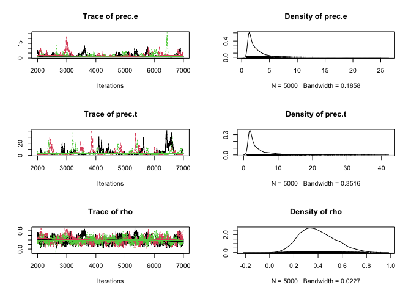

Time series and spatial data
================

## Introduction

In this part, we will demonstrate how one can use MCMC and data cloning
to analyze time series data sets. These examples can be extended to
longitudinal data sets, spatial data sets quite easily.

These models also tend to have missing observations. The code can be
modified easily to account for the missing observations for estimating
the parameters. We may also want to *predict* the values of the missing
observations. We will demonstrate how to predict missing data or
forecast future observations.

## Auto-regression of order 1 (AR(1) process)

This is one of the most basic time series models. The AR(1) model can be
written as:


where

and
")
are indepedent random variables (*N* is shorthand for the Normal
distribution).

This model says that the next year’s value is related to the past year’s
value. That is, the value in the past year is a good predictor for the
next year’s value. Hence the term ‘auto-regression’. This model can be
used to model many different phenomena that proceed in time. For
example, tomorrow’s temperature can be predicted using today’s
temperature (except in Alberta!). Next day’s stock price is likely to be
related to today’s price and so on.

This model can be modified to include covariates. Hence, we can write:

+\epsilon_{i}")

This allows for correlated environmental noise in regression.

This model has been used to model changes in wildlife populations. It is
useful in epidemiology and so on. Many econometric models are derived
from this basic model.

Of course, reality is most of the times more complicated than this
model. For example, one may not observe the response without error. This
is called an observation error. We may not (most of the times, we will
not) observe the true population size but only an estimate (or an index)
of the true population size. Thus, the observed value is not the true
response. Such cases are modelled using a hierarchical structure:

- Hierarchy 1 (True state model):
  
- Hierarchy 2 (Observation model):
  
  where
   is
  observation error and
  ")
  are independent random variables

This is what is called a ‘Kalman filter’ after a famous Hungarian
electrical engineer, Professor Rudolf Kalman. This is a particular case
of the model class ‘State space models’. They consist of at least two
hierarchies: one models the true underlying phenomenon and the other the
observation process that models the error due to observation process.

Under the Normal distribution assumption, the mathematics can be worked
out for the simple linear model to conduct the likelihood inference. But
once we enter the non-linear time series modelling or non-Gaussian
observation processes, mathematics become nearly impossible. We will see
an example of this a bit later. It will also illustrate why the MCMC
algorithm is considered one of the greatest inventions in modern
science.

For the time being, let us avoid all the mathematics and see if we can
use JAGS and dclone to conduct the statistical analysis.

> No math please!!! – this is our motto.

``` r
library(dclone)
```

    ## Loading required package: coda

    ## Loading required package: parallel

    ## Loading required package: Matrix

    ## dclone 2.3-1      2023-04-07

``` r
T_max = 100  # Number of time steps
rho = 0.3
sigma.e = 1
tau.e = 0.25
X = rep(0, T_max)

# This is the stationary distribution for the AR(1) process
X[1] = rnorm(1, 0, sigma.e/sqrt(1-rho^2))

for (t in 2:(T_max)){
  X[t] = rho*X[t-1] + rnorm(1, 0, sigma.e)
}

# Add observation error
Y = rnorm(length(X), X, tau.e)

plot(Y, type="l", lty=2, xlab="Time", ylab="Value")
lines(X)
legend("topleft", lty=c(1, 2), legend=c("True", "Observed"))
```

<!-- -->

We will start with the Bayesian approach.

``` r
AR1_Bayes_model = function(){
  # Likelihood
  prec.1 <- (1-rho*rho) * prec.e
  X[1] ~ dnorm(0, prec.1)
  Y[1] ~ dnorm(X[1], prec.t)
  for (t in 2:T_max){
    mu[t] <- rho * X[(t-1)]
    X[t] ~ dnorm(mu[t], prec.e)
    Y[t] ~ dnorm(X[t], prec.t)
  }
  # Priors
  rho ~ dunif(-1, 1)
  prec.e ~ dgamma(0.1, 0.1)
  prec.t ~ dgamma(0.1, 0.1)
}
```

Get the data and run the analysis.

``` r
Y = as.vector(Y)
dat = list(Y=Y, T_max=T_max)
ini = list(X=Y)
AR1_Bayes_fit = jags.fit(data=dat, params=c("rho","prec.e","prec.t"), model=AR1_Bayes_model)
```

    ## Registered S3 method overwritten by 'R2WinBUGS':
    ##   method            from  
    ##   as.mcmc.list.bugs dclone

    ## Compiling model graph
    ##    Resolving undeclared variables
    ##    Allocating nodes
    ## Graph information:
    ##    Observed stochastic nodes: 100
    ##    Unobserved stochastic nodes: 103
    ##    Total graph size: 310
    ## 
    ## Initializing model

``` r
summary(AR1_Bayes_fit)
```

    ## 
    ## Iterations = 2001:7000
    ## Thinning interval = 1 
    ## Number of chains = 3 
    ## Sample size per chain = 5000 
    ## 
    ## 1. Empirical mean and standard deviation for each variable,
    ##    plus standard error of the mean:
    ## 
    ##         Mean     SD Naive SE Time-series SE
    ## prec.e 1.772 1.1264 0.009197        0.07823
    ## prec.t 6.278 5.6375 0.046030        0.36594
    ## rho    0.393 0.1259 0.001028        0.00252
    ## 
    ## 2. Quantiles for each variable:
    ## 
    ##          2.5%    25%    50%    75%  97.5%
    ## prec.e 0.9583 1.2525 1.4975 1.9022  4.144
    ## prec.t 1.4006 2.7996 4.4722 7.6417 22.494
    ## rho    0.1463 0.3106 0.3913 0.4761  0.642

``` r
plot(AR1_Bayes_fit)
```

<!-- -->

We will modify this to get the MLE using data cloning.

``` r
AR1_DC_model = function(){
  # Likelihood
  for (k in 1:ncl){
    X[1,k] ~ dnorm(0, prec.1)
    Y[1,k] ~ dnorm(X[1,k], prec.t)
    for (t in 2:T_max){
        mu[t,k] <- rho*X[(t-1),k]
        X[t,k] ~ dnorm(mu[t,k], prec.e)
        Y[t,k] ~ dnorm(X[t,k], prec.t)
    }
  }
  # Priors
  rho ~ dunif(-1, 1)
  prec.e ~ dgamma(0.1, 0.1)
  prec.t ~ dgamma(0.1, 0.1)
  prec.1 <- (1-rho*rho) * prec.e
}
```

Get the data and run the analysis with data cloning.

``` r
Y = array(Y, dim=c(length(Y), 1))
Y = dcdim(Y)
dat = list(Y=Y, T_max=T_max, ncl=1)
ini = list(X=Y)
initfn = function(model, n.clones){
  return(list(X=dclone(Y, n.clones)))
}
AR1_DC_fit = dc.fit(data=dat,params=c("rho","prec.t","prec.e"),model=AR1_DC_model,
    unchanged="T_max",multiply="ncl",
    n.clones=c(1, 10, 20),
    inits=ini, initsfun=initfn)
```

    ## 
    ## Fitting model with 1 clone 
    ## 
    ## Compiling model graph
    ##    Resolving undeclared variables
    ##    Allocating nodes
    ## Graph information:
    ##    Observed stochastic nodes: 100
    ##    Unobserved stochastic nodes: 103
    ##    Total graph size: 311
    ## 
    ## Initializing model
    ## 
    ## 
    ## Fitting model with 10 clones 
    ## 
    ## Compiling model graph
    ##    Resolving undeclared variables
    ##    Allocating nodes
    ## Graph information:
    ##    Observed stochastic nodes: 1000
    ##    Unobserved stochastic nodes: 1003
    ##    Total graph size: 3002
    ## 
    ## Initializing model
    ## 
    ## 
    ## Fitting model with 20 clones 
    ## 
    ## Compiling model graph
    ##    Resolving undeclared variables
    ##    Allocating nodes
    ## Graph information:
    ##    Observed stochastic nodes: 2000
    ##    Unobserved stochastic nodes: 2003
    ##    Total graph size: 5992
    ## 
    ## Initializing model

    ## Warning in dclone::.dcFit(data, params, model, inits, n.clones, multiply =
    ## multiply, : chains convergence problem, see R.hat values

``` r
summary(AR1_DC_fit)
```

    ## 
    ## Iterations = 2001:7000
    ## Thinning interval = 1 
    ## Number of chains = 3 
    ## Sample size per chain = 5000 
    ## Number of clones = 20
    ## 
    ## 1. Empirical mean and standard deviation for each variable,
    ##    plus standard error of the mean:
    ## 
    ##           Mean      SD   DC SD  Naive SE Time-series SE R hat
    ## prec.e  1.2104 0.07033  0.3145 0.0005743      0.0079082 1.085
    ## prec.t 17.2381 8.52393 38.1202 0.0695976      1.4040514 1.296
    ## rho     0.3509 0.02495  0.1116 0.0002037      0.0009894 1.032
    ## 
    ## 2. Quantiles for each variable:
    ## 
    ##         2.5%     25%     50%     75%   97.5%
    ## prec.e 1.098  1.1627  1.2014  1.2472  1.3837
    ## prec.t 6.250 11.2048 15.1937 21.3701 39.0880
    ## rho    0.303  0.3341  0.3505  0.3673  0.4011

``` r
dcdiag(AR1_DC_fit)
```

    ##   n.clones lambda.max  ms.error  r.squared    r.hat
    ## 1        1   35.34487 41.049049 0.46651078 1.013016
    ## 2       10   92.57603  3.027127 0.13375675 1.077073
    ## 3       20   72.65942  1.240150 0.05851262 1.180245

``` r
plot(dcdiag(AR1_DC_fit))
```

<!-- -->

Try running the above code when true `rho=0`.

- Are the parameters estimable?
- Does the Bayesian approach tell you that?

Without the estimability diagnostics, you could be easily mislead by the
Bayesian approach. You will merrily go around with the scientific
inference when the parameters are not estimable.

## Different types of measurement errors

1: Clipped or Censored time series

Suppose the underlying process is AR(1) but the observed process is a
clipped process such that it is 1 if
 is positive and 0 if
 is negative. This is
called a clipped time series. Similarly you may observe
 to belong to an
interval. This is an interval censored data. The above model can be
modified to accommodate such a process. An easier way to model binary,
count or proportion time series is as follows.

### Modelling binary and count data time series

For modelling binary time series, we can consider the observation
process as:

")
where
=\gamma*X_{t}")

For modelling count data time series, we can consider

")
where
.

This is a time series generalization of the GLMM that we considered
before.

*Caveat*: It is extremely important that you check for the estimability
of the parameters for these models. Because of clipping and other
observation processes, you are more likely to run into estimability
issues. As far as we know, data cloning is the only method that allows
estimability diagnostics as part of the estimation process. See Lele
([2010](https://github.com/datacloning/workshop-2023-edmonton/blob/main/docs/lele-2010-built-on-sand.pdf)).

### Non-linear time series analysis

Now we will consider a non-linear time series model, Beverton-Holt
growth model, that is commonly used in ecology.

In ecology and population biology, one wants to understand how abundance
changes over time. Following Malthus’ thinking, it is also evident that,
in a finite environment, abundance cannot increase without limit.

Thus, the growth is usually exponential at the beginning (low
population, ignore the Allee effect for now) and then it slows down as
we approach the carrying capacity. One commonly used model is the
Beverton-Holt model (discrete analog to the continuous Logistic model):

Let
=X_{t}")
where  is the
abundance at time . A
general form for the population growth models is:


where  is
")
random variable. This is similar to the AR(1) process but with a
non-linear mean structure.

If
+x_{t}-log(1+\beta N_{t})"),
the population growth model is called the Beverton-Holt model. It has an
upper limit

called the Carrying capacity, the maximum population size that can be
attained (with some perturbation).

In practice, we usually have to conduct some sampling to *estimate* the
abundance. Hence there is measurement error. We can represent this
process by using hierarchical model:

- Hierarchy 1: Process model,
  ,\sigma^{2})")
- Hierarchy 2: Observation model,
  ")

One can use other observation models as well. We can write the
likelihood function for this using a

(length of the time series) dimensional integral. If the time series is
of length 30, this will be a 30 dimensional integral. In order to
compute the MLE, we will need to evaluate this integral repeatedly until
the numerical optimization routine converges. This is a nearly
impossible task.

The code to analyze this non-linear time series with non-Gaussian
observation error can be written as follows.

``` r
BH_Bayes_fn= function() {
  # Likelihood
  X[1] ~ dnorm(mu0, 1 / sigma^2) # Initial condition
  for(i in 2:(n+1)){
    Y[(i-1)] ~ dpois(exp(X[i])) 
    X[i] ~ dnorm(mu[i], 1 / sigma^2) 
    mu[i] <- X[(i-1)] + log(lambda) - log(1 + beta * exp(X[(i-1)]))
  }

  # Priors on model parameters: They are on the real line.
  ln.beta ~ dnorm(0, 0.1) 
  ln.sigma ~ dnorm(0, 0.1)
  ln.tmp ~ dnorm(0, 0.1)

  # Parameters on the natural scale
  beta <- exp(ln.beta)
  sigma <- exp(ln.sigma)
  tmp <- exp(ln.tmp)
  lambda <- tmp + 1
  mu0 <- log(2)  + log(lambda) - log(1 + beta * 2)
}
```

Gause’s *Paramecium* data.

``` r
Paramecium = c(17,29,39,63,185,258,267,392,510,570,650,560,575,650,550,480,520,500)
plot(Paramecium, type="b")
```

<!-- -->

Bayesian analysis.

``` r
Y = Paramecium
dat = list(n=length(Y), Y=Y)
BH_Bayes_fit = jags.fit(data=dat, params=c("ln.tmp","ln.beta","ln.sigma"), model=BH_Bayes_fn)
```

    ## Compiling model graph
    ##    Resolving undeclared variables
    ##    Allocating nodes
    ## Graph information:
    ##    Observed stochastic nodes: 18
    ##    Unobserved stochastic nodes: 22
    ##    Total graph size: 167
    ## 
    ## Initializing model

``` r
summary(BH_Bayes_fit)
```

    ## 
    ## Iterations = 2001:7000
    ## Thinning interval = 1 
    ## Number of chains = 3 
    ## Sample size per chain = 5000 
    ## 
    ## 1. Empirical mean and standard deviation for each variable,
    ##    plus standard error of the mean:
    ## 
    ##             Mean     SD Naive SE Time-series SE
    ## ln.beta  -6.1524 0.1669 0.001363       0.004691
    ## ln.sigma -1.9513 0.2739 0.002236       0.006891
    ## ln.tmp    0.1581 0.1270 0.001037       0.003675
    ## 
    ## 2. Quantiles for each variable:
    ## 
    ##              2.5%      25%     50%    75%   97.5%
    ## ln.beta  -6.49550 -6.25349 -6.1476 -6.049 -5.8236
    ## ln.sigma -2.46652 -2.13917 -1.9558 -1.767 -1.4069
    ## ln.tmp   -0.09701  0.08114  0.1602  0.237  0.4076

We can easily modify this program to obtain the MLE and its asymptotic
variance.

``` r
BH_DC_fn= function() {
  # Likelihood
  for (k in 1:ncl) {
    for(i in 2:(n+1)){
      Y[(i-1), k] ~ dpois(exp(X[i, k])) 
      X[i, k] ~ dnorm(mu[i, k], 1 / sigma^2) 
      mu[i, k] <- X[(i-1), k] + log(lambda) - log(1 + beta * exp(X[(i-1), k]))
    }
    X[1, k] ~ dnorm(mu0, 1 / sigma^2) 
  }

  # Priors on model parameters: They are on the real line.
  ln.beta ~ dnorm(0, 0.1) 
  ln.sigma ~ dnorm(0, 0.1)
  ln.tmp ~ dnorm(0, 0.1)

  # Parameters on the natural scale
  beta <- exp(ln.beta)
  sigma <- exp(ln.sigma)
  tmp <- exp(ln.tmp)
  lambda <- tmp + 1
  mu0 <- log(2)  + log(lambda) - log(1 + beta * 2)
}
```

Assemble the data and fit with data cloning.

``` r
Y = array(Y, dim=c(length(Y), 1))
Y = dcdim(Y)
dat = list(ncl=1, n=18, Y=Y)

n.clones = c(1, 5, 10)
params = c("ln.tmp", "ln.beta", "ln.sigma")
BH_MLE = dc.fit(data=dat, params=params, model=BH_DC_fn,
    n.clones=n.clones,
    multiply="ncl", unchanged="n",
    n.chains=5, n.update=1000, n.iter=5000, n.adapt=2000)
```

    ## 
    ## Fitting model with 1 clone 
    ## 
    ## Compiling model graph
    ##    Resolving undeclared variables
    ##    Allocating nodes
    ## Graph information:
    ##    Observed stochastic nodes: 18
    ##    Unobserved stochastic nodes: 22
    ##    Total graph size: 168
    ## 
    ## Initializing model
    ## 
    ## 
    ## Fitting model with 5 clones 
    ## 
    ## Compiling model graph
    ##    Resolving undeclared variables
    ##    Allocating nodes
    ## Graph information:
    ##    Observed stochastic nodes: 90
    ##    Unobserved stochastic nodes: 98
    ##    Total graph size: 752
    ## 
    ## Initializing model
    ## 
    ## 
    ## Fitting model with 10 clones 
    ## 
    ## Compiling model graph
    ##    Resolving undeclared variables
    ##    Allocating nodes
    ## Graph information:
    ##    Observed stochastic nodes: 180
    ##    Unobserved stochastic nodes: 193
    ##    Total graph size: 1482
    ## 
    ## Initializing model

``` r
dcdiag(BH_MLE)
```

    ##   n.clones  lambda.max   ms.error   r.squared    r.hat
    ## 1        1 0.080578971 2.05897289 0.125435344 1.005363
    ## 2        5 0.014442958 0.03579877 0.003989667 1.003206
    ## 3       10 0.007320426 0.01529539 0.001367944 1.004197

Parameters for this model are estimable. It will be interesting to see
if one can use Negative Binomial distribution (one additional parameter)
instead of the Poisson distribution. Are the parameters still estimable?
(TBD!!!)

## Prediction

We are also interested in predicting the true population abundances as
well as forecasting the future trajectory of the abundances. This is
quite easy under the Bayesian paradigm. The frequentist paradigm
involves an additional step.

Let us see how to use the Bayesian paradigm and MCMC to do this. In the
Bayesian paradigm, there is no difference between parameters and the
unobserved states. They both are considered random variables.

On the other hand, in the frequentist paradigm parameters are fixed but
unknown (not random) whereas the unobserved states are true random
variables.

We (the instructors) consider these to be different.

1.  Information about the parameters converges to infinity as the sample
    size increases. Thus, we can *estimate* them with high degree of
    confidence. The *confidence* intervals shrink as we increase the
    sample size.
2.  Information about the states (random variables) does not converge to
    infinity as the sample size increases. The *prediction* intervals do
    not shrink.

This should be familiar to most of you from your regression class.

``` r
BH_Bayes_fn= function() {
  # Likelihood
  X[1] ~ dnorm(mu0, 1 / sigma^2) # Initial condition
  N[1] <- exp(X[1])
  for(i in 2:(n+1)){
    Y[(i-1)] ~ dpois(exp(X[i])) 
    X[i] ~ dnorm(mu[i], 1 / sigma^2) 
    mu[i] <- X[(i-1)] + log(lambda) - log(1 + beta * exp(X[(i-1)]))
    N[i] <- exp(X[i])
  }

  # Priors on model parameters: They are on the real line.
  ln.beta ~ dnorm(0, 0.1) 
  ln.sigma ~ dnorm(0, 0.1)
  ln.tmp ~ dnorm(0, 0.1)

  # Parameters on the natural scale
  beta <- exp(ln.beta)
  sigma <- exp(ln.sigma)
  tmp <- exp(ln.tmp)
  lambda <- tmp + 1
  mu0 <- log(2)  + log(lambda) - log(1 + beta * 2)
}

# Gause's data 
Y = Paramecium
dat = list(n=length(Y), Y=Y)
BH_Bayes_fit = jags.fit(data=dat, params=c("N"), model=BH_Bayes_fn)
```

    ## Compiling model graph
    ##    Resolving undeclared variables
    ##    Allocating nodes
    ## Graph information:
    ##    Observed stochastic nodes: 18
    ##    Unobserved stochastic nodes: 22
    ##    Total graph size: 167
    ## 
    ## Initializing model

``` r
summary(BH_Bayes_fit)
```

    ## 
    ## Iterations = 2001:7000
    ## Thinning interval = 1 
    ## Number of chains = 3 
    ## Sample size per chain = 5000 
    ## 
    ## 1. Empirical mean and standard deviation for each variable,
    ##    plus standard error of the mean:
    ## 
    ##          Mean      SD Naive SE Time-series SE
    ## N[1]    4.798  0.6488 0.005298        0.01112
    ## N[2]   11.366  1.7378 0.014189        0.03695
    ## N[3]   23.475  3.1004 0.025314        0.05740
    ## N[4]   41.818  4.3041 0.035143        0.06456
    ## N[5]   76.006  7.0875 0.057869        0.11212
    ## N[6]  172.324 11.9339 0.097440        0.16515
    ## N[7]  254.042 14.3826 0.117433        0.15077
    ## N[8]  281.411 16.1812 0.132119        0.22244
    ## N[9]  393.208 18.2276 0.148828        0.19025
    ## N[10] 506.992 21.2324 0.173362        0.22254
    ## N[11] 569.251 22.4809 0.183556        0.23180
    ## N[12] 640.603 24.7879 0.202392        0.27098
    ## N[13] 563.626 22.6319 0.184788        0.23725
    ## N[14] 576.416 22.4849 0.183589        0.23127
    ## N[15] 641.187 24.7122 0.201774        0.27197
    ## N[16] 550.786 22.5831 0.184391        0.23720
    ## N[17] 486.605 21.0579 0.171937        0.22373
    ## N[18] 518.184 21.4506 0.175143        0.22362
    ## N[19] 503.257 21.3087 0.173985        0.22448
    ## 
    ## 2. Quantiles for each variable:
    ## 
    ##          2.5%     25%     50%     75%   97.5%
    ## N[1]    3.757   4.363   4.715   5.134   6.342
    ## N[2]    8.675  10.165  11.112  12.311  15.411
    ## N[3]   18.297  21.285  23.159  25.319  30.492
    ## N[4]   33.737  38.933  41.656  44.620  50.786
    ## N[5]   62.096  71.238  75.936  80.844  89.946
    ## N[6]  150.257 164.130 171.972 179.837 197.243
    ## N[7]  227.248 244.033 253.627 263.490 283.493
    ## N[8]  250.497 270.307 281.331 292.361 313.561
    ## N[9]  358.315 380.728 392.993 405.266 429.743
    ## N[10] 466.680 492.419 506.524 521.203 549.044
    ## N[11] 526.209 553.899 568.934 584.297 613.453
    ## N[12] 593.298 623.806 640.004 656.933 691.265
    ## N[13] 521.207 548.058 562.898 578.639 609.151
    ## N[14] 533.085 561.196 576.085 590.950 621.943
    ## N[15] 594.432 624.402 640.675 657.495 691.001
    ## N[16] 506.870 535.476 550.429 565.597 596.554
    ## N[17] 446.497 472.095 486.321 500.434 528.869
    ## N[18] 477.291 503.352 517.793 532.384 561.095
    ## N[19] 462.342 488.650 503.152 517.544 546.190

``` r
boxplot(unname(as.matrix(BH_Bayes_fit)), range=0, border="darkgrey")
lines(c(NA, Y))
```

<!-- -->

If we want to obtain predictions that are invariant to parameterization
and correct in the frequentist sense, we need to modify this approach
slightly. We need to change the prior distribution to the asymptotic
distribution of the MLE. This can be done quite easily as follows.

``` r
BH_DC_pred_fn= function() {
  # Likelihood
  X[1] ~ dnorm(mu0, 1 / sigma^2) # Initial condition
  N[1] <- exp(X[1])
  for(i in 2:(n+1)){
    Y[(i-1)] ~ dpois(exp(X[i])) 
    X[i] ~ dnorm(mu[i], 1 / sigma^2) 
    mu[i] <- X[(i-1)] + log(lambda) - log(1 + beta * exp(X[(i-1)]))
    N[i] <- exp(X[i])
  }

  # Priors on model parameters: they are on the real line.
  parms ~ dmnorm(MuPost,PrecPost)
  ln.beta <- parms[1] 
  ln.sigma <- parms[2]
  ln.tmp <- parms[3]

  # Parameters on the natural scale
  beta <- exp(ln.beta)
  sigma <- exp(ln.sigma)
  tmp <- exp(ln.tmp)
  lambda <- tmp + 1
  mu0 <- log(2)  + log(lambda) - log(1 + beta * 2)
}

# Gause's data 
Y = Paramecium
dat = list(n=length(Y), Y=Y, MuPost=coef(BH_MLE), PrecPost=solve(vcov(BH_MLE)))
BH_DC_Pred = jags.fit(data=dat, params=c("N"), model=BH_DC_pred_fn)
```

    ## Compiling model graph
    ##    Resolving undeclared variables
    ##    Allocating nodes
    ## Graph information:
    ##    Observed stochastic nodes: 18
    ##    Unobserved stochastic nodes: 20
    ##    Total graph size: 180
    ## 
    ## Initializing model

``` r
summary(BH_DC_Pred)
```

    ## 
    ## Iterations = 2001:7000
    ## Thinning interval = 1 
    ## Number of chains = 3 
    ## Sample size per chain = 5000 
    ## 
    ## 1. Empirical mean and standard deviation for each variable,
    ##    plus standard error of the mean:
    ## 
    ##          Mean      SD Naive SE Time-series SE
    ## N[1]    4.713  0.5384 0.004396       0.009624
    ## N[2]   11.002  1.4453 0.011801       0.034288
    ## N[3]   22.917  2.6868 0.021938       0.058206
    ## N[4]   41.946  4.1754 0.034092       0.066613
    ## N[5]   77.259  6.6343 0.054169       0.115149
    ## N[6]  170.668 11.1820 0.091301       0.187360
    ## N[7]  252.798 14.0841 0.114996       0.161348
    ## N[8]  283.139 15.6387 0.127689       0.272678
    ## N[9]  393.645 18.1459 0.148161       0.191189
    ## N[10] 506.654 21.2097 0.173177       0.227677
    ## N[11] 569.222 22.3524 0.182507       0.238118
    ## N[12] 640.097 23.8440 0.194685       0.278207
    ## N[13] 563.586 22.2321 0.181524       0.235367
    ## N[14] 576.419 22.2754 0.181878       0.232191
    ## N[15] 639.181 23.9305 0.195392       0.257009
    ## N[16] 550.816 22.0123 0.179730       0.237721
    ## N[17] 487.912 20.7511 0.169432       0.223389
    ## N[18] 517.863 21.3374 0.174219       0.222328
    ## N[19] 504.284 21.4139 0.174844       0.230551
    ## 
    ## 2. Quantiles for each variable:
    ## 
    ##          2.5%     25%     50%     75%   97.5%
    ## N[1]    3.781   4.347   4.664   5.029   5.912
    ## N[2]    8.597   9.990  10.856  11.844  14.347
    ## N[3]   18.237  21.007  22.704  24.559  28.808
    ## N[4]   34.246  39.038  41.775  44.632  50.631
    ## N[5]   64.509  72.782  77.148  81.634  90.517
    ## N[6]  149.781 162.960 170.280 178.089 193.601
    ## N[7]  226.169 243.211 252.286 262.099 281.270
    ## N[8]  252.333 272.888 282.898 293.566 313.886
    ## N[9]  359.088 381.224 393.365 405.604 430.372
    ## N[10] 466.055 492.211 506.311 520.894 549.116
    ## N[11] 526.421 553.814 568.968 583.922 614.554
    ## N[12] 594.517 623.788 639.598 656.116 688.096
    ## N[13] 520.959 548.282 563.395 578.749 607.373
    ## N[14] 534.095 561.184 576.337 591.173 621.575
    ## N[15] 594.058 622.671 638.962 655.073 686.929
    ## N[16] 508.439 535.616 550.416 565.674 594.920
    ## N[17] 448.080 473.601 487.663 501.960 529.188
    ## N[18] 477.012 503.284 517.772 531.969 560.291
    ## N[19] 463.663 489.558 504.071 518.571 546.683

``` r
boxplot(unname(as.matrix(BH_DC_Pred)), range=0, border="darkgrey")
lines(c(NA, Y))
```

<!-- -->

If we want to forecast future observations, we modify the program
slightly. To do this, we pretend as if the process had run longer than

but we could not ‘observe’ those future states. Thus, it becomes a
missing data problem. Let us see how we can do this.

``` r
BH_Bayes_fn= function() {
  X[1] ~ dnorm(mu0, 1 / sigma^2) # Initial condition
  N[1] <- exp(X[1])
  for(i in 2:(n+1)){
    Y[(i-1)] ~ dpois(exp(X[i]))
  }
  for (i in 2:N_future){
    X[i] ~ dnorm(mu[i], 1 / sigma^2) 
    mu[i] <- X[(i-1)] + log(lambda) - log(1 + beta * exp(X[(i-1)]))
    N[i] <- exp(X[i])
  }

  # Priors on model parameters: they are on the real line.
  ln.beta ~ dnorm(0, 0.1) 
  ln.sigma ~ dnorm(0, 0.1)
  ln.tmp ~ dnorm(0, 0.1)

  # Parameters on the natural scale
  beta <- exp(ln.beta)
  sigma <- exp(ln.sigma)
  tmp <- exp(ln.tmp)
  lambda <- tmp + 1
  mu0 <- log(2)  + log(lambda) - log(1 + beta * 2)
}

# Gause's data 
Y = Paramecium

# We want to predict 3 years in future.
dat = list(n=length(Y), Y=Y, N_future=length(Y)+3)

BH_Bayes_fit = jags.fit(data=dat, params=c("N[19:21]"), model=BH_Bayes_fn)
```

    ## Compiling model graph
    ##    Resolving undeclared variables
    ##    Allocating nodes
    ## Graph information:
    ##    Observed stochastic nodes: 18
    ##    Unobserved stochastic nodes: 24
    ##    Total graph size: 182
    ## 
    ## Initializing model

``` r
summary(BH_Bayes_fit)
```

    ## 
    ## Iterations = 2001:7000
    ## Thinning interval = 1 
    ## Number of chains = 3 
    ## Sample size per chain = 5000 
    ## 
    ## 1. Empirical mean and standard deviation for each variable,
    ##    plus standard error of the mean:
    ## 
    ##        Mean     SD Naive SE Time-series SE
    ## N[19] 503.4  21.56   0.1760         0.2244
    ## N[20] 532.8  88.44   0.7221         0.7346
    ## N[21] 545.3 103.78   0.8474         0.9350
    ## 
    ## 2. Quantiles for each variable:
    ## 
    ##        2.5%   25%   50%   75% 97.5%
    ## N[19] 461.9 488.8 502.9 518.0 546.5
    ## N[20] 375.7 475.6 526.7 581.9 727.1
    ## N[21] 366.8 478.9 536.2 601.6 776.7

``` r
pred = mcmcapply(BH_Bayes_fit, quantile, c(0.05, 0.5, 0.95))
plot(c(Y, NA, NA, NA), type="l", ylim=c(0, max(Y, pred)), xlab="Time", ylab="Value")
matlines(c(18:21), 
    t(cbind(rep(Y[length(Y)], 3), pred)),
    col=4, lty=c(2,1,2))
```

<!-- -->

To get the frequentist version, we modify this prediction function
similarly. The prior is equal to the asymptotic distribution of the MLE.
We will leave it to you to try that out.
