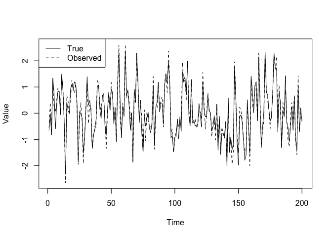

Time series and spatial data
================

## Introduction

In this part, we will demonstrate how one can use MCMC and data cloning
to analyze time series data sets. These examples can be extended to
longitudinal data sets, spatial data sets quite easily.

These models also tend to have missing observations. The code can be
modified easily to account for the missing observations for estimating
the parameters. We may also want to *predict* the values of the missing
observations. We will demonstrate how to predict missing data or
forecast future observations.

## Auto-regression of order 1 (AR(1) process)

This is one of the most basic time series models. The AR(1) model can be
written as:


where

and
")
are indepedent random variables (*N* is shorthand for the Normal
distribution).

This model says that the next year’s value is related to the past year’s
value. That is, the value in the past year is a good predictor for the
next year’s value. Hence the term ‘auto-regression’. This model can be
used to model many different phenomena that proceed in time. For
example, tomorrow’s temperature can be predicted using today’s
temperature (except in Alberta!). Next day’s stock price is likely to be
related to today’s price and so on.

This model can be modified to include covariates. Hence, we can write:

+\epsilon_{i}")

This allows for correlated environmental noise in regression.

This model has been used to model changes in wildlife populations. It is
useful in epidemiology and so on. Many econometric models are derived
from this basic model.

Of course, reality is most of the times more complicated than this
model. For example, one may not observe the response without error. This
is called an observation error. We may not (most of the times, we will
not) observe the true population size but only an estimate (or an index)
of the true population size. Thus, the observed value is not the true
response. Such cases are modelled using a hierarchical structure:

- Hierarchy 1 (True state model):
  
- Hierarchy 2 (Observation model):
  
  where
   is
  observation error and
  ")
  are independent random variables

This is what is called a ‘Kalman filter’ after a famous Hungarian
electrical engineer, Professor Rudolf Kalman. This is a particular case
of the model class ‘State space models’. They consist of at least two
hierarchies: one models the true underlying phenomenon and the other the
observation process that models the error due to observation process.

Under the Normal distribution assumption, the mathematics can be worked
out for the simple linear model to conduct the likelihood inference. But
once we enter the non-linear time series modelling or non-Gaussian
observation processes, mathematics become nearly impossible. We will see
an example of this a bit later. It will also illustrate why the MCMC
algorithm is considered one of the greatest inventions in modern
science.

For the time being, let us avoid all the mathematics and see if we can
use JAGS and dclone to conduct the statistical analysis.

> No math please!!! – this is our motto.

``` r
library(dclone)
```

    ## Loading required package: coda

    ## Loading required package: parallel

    ## Loading required package: Matrix

    ## dclone 2.3-1      2023-04-07

``` r
T_max = 200  # Number of time steps
rho = 0.3
sigma.e = 1
tau.e = 0.25
X = rep(0, T_max)

# This is the stationary distribution for the AR(1) process
X[1] = rnorm(1, 0, sigma.e/sqrt(1-rho^2))

for (t in 2:(T_max)){
  X[t] = rho*X[t-1] + rnorm(1, 0, sigma.e)
}

# Add observation error
Y = rnorm(length(X), X, tau.e)

plot(Y, type="l", lty=2, xlab="Time", ylab="Value")
lines(X)
legend("topleft", lty=c(1, 2), legend=c("True", "Observed"))
```

<!-- -->

We will start with the Bayesian approach.

``` r
AR1_Bayes_model = function(){
  # Likelihood
  prec.1 <- (1-rho*rho) * prec.e
  X[1] ~ dnorm(0, prec.1)
  Y[1] ~ dnorm(X[1], prec.t)
  for (t in 2:T_max){
    mu[t] <- rho * X[(t-1)]
    X[t] ~ dnorm(mu[t], prec.e)
    Y[t] ~ dnorm(X[t], prec.t)
  }
  # Priors
  rho ~ dunif(-1, 1)
  prec.e ~ dgamma(0.1, 0.1)
  prec.t ~ dgamma(0.1, 0.1)
}
```

Get the data and run the analysis.

``` r
Y = as.vector(Y)
dat = list(Y=Y, T_max=T_max)
ini = list(X=Y)
AR1_Bayes_fit = jags.fit(data=dat, params=c("rho","prec.e","prec.t"), model=AR1_Bayes_model)
```

    ## Registered S3 method overwritten by 'R2WinBUGS':
    ##   method            from  
    ##   as.mcmc.list.bugs dclone

    ## Compiling model graph
    ##    Resolving undeclared variables
    ##    Allocating nodes
    ## Graph information:
    ##    Observed stochastic nodes: 200
    ##    Unobserved stochastic nodes: 203
    ##    Total graph size: 610
    ## 
    ## Initializing model

``` r
summary(AR1_Bayes_fit)
```

    ## 
    ## Iterations = 2001:7000
    ## Thinning interval = 1 
    ## Number of chains = 3 
    ## Sample size per chain = 5000 
    ## 
    ## 1. Empirical mean and standard deviation for each variable,
    ##    plus standard error of the mean:
    ## 
    ##         Mean     SD Naive SE Time-series SE
    ## prec.e 2.570 1.9709 0.016092       0.174432
    ## prec.t 4.359 4.5044 0.036779       0.383831
    ## rho    0.396 0.1466 0.001197       0.009174
    ## 
    ## 2. Quantiles for each variable:
    ## 
    ##          2.5%    25%    50%    75%   97.5%
    ## prec.e 1.0604 1.4037 1.9321 3.0111  7.6855
    ## prec.t 1.2703 1.8390 2.6591 4.8807 18.1782
    ## rho    0.1485 0.2889 0.3809 0.4929  0.7124

``` r
plot(AR1_Bayes_fit)
```

<!-- -->

We will modify this to get the MLE using data cloning.

``` r
AR1_DC_model = function(){
  # Likelihood
  for (k in 1:ncl){
    X[1,k] ~ dnorm(0, prec.1)
    Y[1,k] ~ dnorm(X[1,k], prec.t)
    for (t in 2:T_max){
        mu[t,k] <- rho*X[(t-1),k]
        X[t,k] ~ dnorm(mu[t,k], prec.e)
        Y[t,k] ~ dnorm(X[t,k], prec.t)
    }
  }
  # Priors
  rho ~ dunif(-1, 1)
  prec.e ~ dgamma(0.1, 0.1)
  prec.t ~ dgamma(0.1, 0.1)
  prec.1 <- (1-rho*rho) * prec.e
}
```

Get the data and run the analysis with data cloning.

``` r
Y = array(Y, dim=c(length(Y), 1))
Y = dcdim(Y)
dat = list(Y=Y, T_max=T_max, ncl=1)
ini = list(X=Y)
initfn = function(model, n.clones){
  return(list(X=dclone(Y, n.clones)))
}
AR1_DC_fit = dc.fit(data=dat,params=c("rho","prec.t","prec.e"),model=AR1_DC_model,
    unchanged="T_max",multiply="ncl",
    n.clones=c(1, 10, 20),
    inits=ini, initsfun=initfn)
```

    ## 
    ## Fitting model with 1 clone 
    ## 
    ## Compiling model graph
    ##    Resolving undeclared variables
    ##    Allocating nodes
    ## Graph information:
    ##    Observed stochastic nodes: 200
    ##    Unobserved stochastic nodes: 203
    ##    Total graph size: 611
    ## 
    ## Initializing model
    ## 
    ## 
    ## Fitting model with 10 clones 
    ## 
    ## Compiling model graph
    ##    Resolving undeclared variables
    ##    Allocating nodes
    ## Graph information:
    ##    Observed stochastic nodes: 2000
    ##    Unobserved stochastic nodes: 2003
    ##    Total graph size: 6002
    ## 
    ## Initializing model
    ## 
    ## 
    ## Fitting model with 20 clones 
    ## 
    ## Compiling model graph
    ##    Resolving undeclared variables
    ##    Allocating nodes
    ## Graph information:
    ##    Observed stochastic nodes: 4000
    ##    Unobserved stochastic nodes: 4003
    ##    Total graph size: 11992
    ## 
    ## Initializing model

    ## Warning in dclone::.dcFit(data, params, model, inits, n.clones, multiply =
    ## multiply, : chains convergence problem, see R.hat values

``` r
summary(AR1_DC_fit)
```

    ## 
    ## Iterations = 2001:7000
    ## Thinning interval = 1 
    ## Number of chains = 3 
    ## Sample size per chain = 5000 
    ## Number of clones = 20
    ## 
    ## 1. Empirical mean and standard deviation for each variable,
    ##    plus standard error of the mean:
    ## 
    ##          Mean      SD  DC SD Naive SE Time-series SE R hat
    ## prec.e 1.9284 0.44600 1.9946 0.003642       0.075424 1.100
    ## prec.t 3.2118 1.24420 5.5642 0.010159       0.245168 1.191
    ## rho    0.3771 0.05976 0.2673 0.000488       0.009764 1.108
    ## 
    ## 2. Quantiles for each variable:
    ## 
    ##          2.5%    25%    50%    75%  97.5%
    ## prec.e 1.3014 1.5944 1.8427 2.1861 3.0264
    ## prec.t 1.8615 2.3544 2.8599 3.6733 6.9722
    ## rho    0.2753 0.3326 0.3725 0.4176 0.5054

``` r
dcdiag(AR1_DC_fit)
```

    ##   n.clones lambda.max  ms.error r.squared    r.hat
    ## 1        1  12.790437 28.537190 0.4222494 1.123060
    ## 2       10   2.937209  9.826594 0.2296939 1.084862
    ## 3       20   1.676096  5.334298 0.1617006 1.134098

``` r
plot(dcdiag(AR1_DC_fit))
```

<!-- -->

Try running the above code when true `rho=0`.

- Are the parameters estimable?
- Does the Bayesian approach tell you that?

Without the estimability diagnostics, you could be easily mislead by the
Bayesian approach. You will merrily go around with the scientific
inference when the parameters are not estimable.

## Different types of measurement errors

1: Clipped or Censored time series

Suppose the underlying process is AR(1) but the observed process is a
clipped process such that it is 1 if
 is positive and 0 if
 is negative. This is
called a clipped time series. Similarly you may observe
 to belong to an
interval. This is an interval censored data. The above model can be
modified to accommodate such a process. An easier way to model binary,
count or proportion time series is as follows.

### Modelling binary and count data time series

For modelling binary time series, we can consider the observation
process as:

")
where
=\gamma*X_{t}")

For modelling count data time series, we can consider

")
where
.

This is a time series generalization of the GLMM that we considered
before.

*Caveat*: It is extremely important that you check for the estimability
of the parameters for these models. Because of clipping and other
observation processes, you are more likely to run into estimability
issues. As far as we know, data cloning is the only method that allows
estimability diagnostics as part of the estimation process. See Lele
([2010](https://github.com/datacloning/workshop-2023-edmonton/blob/main/docs/lele-2010-built-on-sand.pdf)).

### Non-linear time series analysis

Now we will consider a non-linear time series model, Beverton-Holt
growth model, that is commonly used in ecology.

In ecology and population biology, one wants to understand how abundance
changes over time. Following Malthus’ thinking, it is also evident that,
in a finite environment, abundance cannot increase without limit.

Thus, the growth is usually exponential at the beginning (low
population, ignore the Allee effect for now) and then it slows down as
we approach the carrying capacity. One commonly used model is the
Beverton-Holt model (discrete analog to the continuous Logistic model):

Let
=X_{t}")
where  is the
abundance at time . A
general form for the population growth models is:


where  is
")
random variable. This is similar to the AR(1) process but with a
non-linear mean structure.

If
+x_{t}-log(1+\beta N_{t})"),
the population growth model is called the Beverton-Holt model. It has an
upper limit

called the Carrying capacity, the maximum population size that can be
attained (with some perturbation).

In practice, we usually have to conduct some sampling to *estimate* the
abundance. Hence there is measurement error. We can represent this
process by using hierarchical model:

- Hierarchy 1: Process model,
  ,\sigma^{2})")
- Hierarchy 2: Observation model,
  ")

One can use other observation models as well. We can write the
likelihood function for this using a

(length of the time series) dimensional integral. If the time series is
of length 30, this will be a 30 dimensional integral. In order to
compute the MLE, we will need to evaluate this integral repeatedly until
the numerical optimization routine converges. This is a nearly
impossible task.

The code to analyze this non-linear time series with non-Gaussian
observation error can be written as follows.

``` r
BH_Bayes_fn= function() {
  # Likelihood
  X[1] ~ dnorm(mu0, 1 / sigma^2) # Initial condition
  for(i in 2:(n+1)){
    Y[(i-1)] ~ dpois(exp(X[i])) 
    X[i] ~ dnorm(mu[i], 1 / sigma^2) 
    mu[i] <- X[(i-1)] + log(lambda) - log(1 + beta * exp(X[(i-1)]))
  }

  # Priors on model parameters: They are on the real line.
  ln.beta ~ dnorm(0, 0.1) 
  ln.sigma ~ dnorm(0, 0.1)
  ln.tmp ~ dnorm(0, 0.1)

  # Parameters on the natural scale
  beta <- exp(ln.beta)
  sigma <- exp(ln.sigma)
  tmp <- exp(ln.tmp)
  lambda <- tmp + 1
  mu0 <- log(2)  + log(lambda) - log(1 + beta * 2)
}
```

Gause’s *Paramecium* data.

``` r
Paramecium = c(17,29,39,63,185,258,267,392,510,570,650,560,575,650,550,480,520,500)
plot(Paramecium, type="b")
```

<!-- -->

Bayesian analysis.

``` r
Y = Paramecium
dat = list(n=length(Y), Y=Y)
BH_Bayes_fit = jags.fit(data=dat, params=c("ln.tmp","ln.beta","ln.sigma"), model=BH_Bayes_fn)
```

    ## Compiling model graph
    ##    Resolving undeclared variables
    ##    Allocating nodes
    ## Graph information:
    ##    Observed stochastic nodes: 18
    ##    Unobserved stochastic nodes: 22
    ##    Total graph size: 167
    ## 
    ## Initializing model

``` r
summary(BH_Bayes_fit)
```

    ## 
    ## Iterations = 2001:7000
    ## Thinning interval = 1 
    ## Number of chains = 3 
    ## Sample size per chain = 5000 
    ## 
    ## 1. Empirical mean and standard deviation for each variable,
    ##    plus standard error of the mean:
    ## 
    ##             Mean     SD Naive SE Time-series SE
    ## ln.beta  -6.1554 0.1651 0.001348       0.004423
    ## ln.sigma -1.9668 0.2810 0.002295       0.006853
    ## ln.tmp    0.1554 0.1261 0.001030       0.003394
    ## 
    ## 2. Quantiles for each variable:
    ## 
    ##             2.5%      25%     50%     75%   97.5%
    ## ln.beta  -6.5061 -6.25334 -6.1504 -6.0535 -5.8363
    ## ln.sigma -2.4973 -2.16293 -1.9707 -1.7756 -1.4063
    ## ln.tmp   -0.1134  0.08144  0.1584  0.2332  0.4028

We can easily modify this program to obtain the MLE and its asymptotic
variance.

``` r
BH_DC_fn= function() {
  # Likelihood
  for (k in 1:ncl) {
    for(i in 2:(n+1)){
      Y[(i-1), k] ~ dpois(exp(X[i, k])) 
      X[i, k] ~ dnorm(mu[i, k], 1 / sigma^2) 
      mu[i, k] <- X[(i-1), k] + log(lambda) - log(1 + beta * exp(X[(i-1), k]))
    }
    X[1, k] ~ dnorm(mu0, 1 / sigma^2) 
  }

  # Priors on model parameters: They are on the real line.
  ln.beta ~ dnorm(0, 0.1) 
  ln.sigma ~ dnorm(0, 0.1)
  ln.tmp ~ dnorm(0, 0.1)

  # Parameters on the natural scale
  beta <- exp(ln.beta)
  sigma <- exp(ln.sigma)
  tmp <- exp(ln.tmp)
  lambda <- tmp + 1
  mu0 <- log(2)  + log(lambda) - log(1 + beta * 2)
}
```

Assemble the data and fit with data cloning.

``` r
Y = array(Y, dim=c(length(Y), 1))
Y = dcdim(Y)
dat = list(ncl=1, n=18, Y=Y)

n.clones = c(1, 5, 10)
params = c("ln.tmp", "ln.beta", "ln.sigma")
BH_MLE = dc.fit(data=dat, params=params, model=BH_DC_fn,
    n.clones=n.clones,
    multiply="ncl", unchanged="n",
    n.chains=5, n.update=1000, n.iter=5000, n.adapt=2000)
```

    ## 
    ## Fitting model with 1 clone 
    ## 
    ## Compiling model graph
    ##    Resolving undeclared variables
    ##    Allocating nodes
    ## Graph information:
    ##    Observed stochastic nodes: 18
    ##    Unobserved stochastic nodes: 22
    ##    Total graph size: 168
    ## 
    ## Initializing model
    ## 
    ## 
    ## Fitting model with 5 clones 
    ## 
    ## Compiling model graph
    ##    Resolving undeclared variables
    ##    Allocating nodes
    ## Graph information:
    ##    Observed stochastic nodes: 90
    ##    Unobserved stochastic nodes: 98
    ##    Total graph size: 752
    ## 
    ## Initializing model
    ## 
    ## 
    ## Fitting model with 10 clones 
    ## 
    ## Compiling model graph
    ##    Resolving undeclared variables
    ##    Allocating nodes
    ## Graph information:
    ##    Observed stochastic nodes: 180
    ##    Unobserved stochastic nodes: 193
    ##    Total graph size: 1482
    ## 
    ## Initializing model

``` r
dcdiag(BH_MLE)
```

    ##   n.clones  lambda.max   ms.error   r.squared    r.hat
    ## 1        1 0.077813396 2.46464624 0.144387820 1.001228
    ## 2        5 0.014738064 0.04861553 0.005266631 1.002731
    ## 3       10 0.007446235 0.01101040 0.001313733 1.004338

Parameters for this model are estimable. It will be interesting to see
if one can use Negative Binomial distribution (one additional parameter)
instead of the Poisson distribution. Are the parameters still estimable?
(TBD!!!)

## Prediction

We are also interested in predicting the true population abundances as
well as forecasting the future trajectory of the abundances. This is
quite easy under the Bayesian paradigm. The frequentist paradigm
involves an additional step.

Let us see how to use the Bayesian paradigm and MCMC to do this. In the
Bayesian paradigm, there is no difference between parameters and the
unobserved states. They both are considered random variables.

On the other hand, in the frequentist paradigm parameters are fixed but
unknown (not random) whereas the unobserved states are true random
variables.

We (the instructors) consider these to be different.

1.  Information about the parameters converges to infinity as the sample
    size increases. Thus, we can *estimate* them with high degree of
    confidence. The *confidence* intervals shrink as we increase the
    sample size.
2.  Information about the states (random variables) does not converge to
    infinity as the sample size increases. The *prediction* intervals do
    not shrink.

This should be familiar to most of you from your regression class.

``` r
BH_Bayes_fn= function() {
  # Likelihood
  X[1] ~ dnorm(mu0, 1 / sigma^2) # Initial condition
  N[1] <- exp(X[1])
  for(i in 2:(n+1)){
    Y[(i-1)] ~ dpois(exp(X[i])) 
    X[i] ~ dnorm(mu[i], 1 / sigma^2) 
    mu[i] <- X[(i-1)] + log(lambda) - log(1 + beta * exp(X[(i-1)]))
    N[i] <- exp(X[i])
  }

  # Priors on model parameters: They are on the real line.
  ln.beta ~ dnorm(0, 0.1) 
  ln.sigma ~ dnorm(0, 0.1)
  ln.tmp ~ dnorm(0, 0.1)

  # Parameters on the natural scale
  beta <- exp(ln.beta)
  sigma <- exp(ln.sigma)
  tmp <- exp(ln.tmp)
  lambda <- tmp + 1
  mu0 <- log(2)  + log(lambda) - log(1 + beta * 2)
}

# Gause's data 
Y = Paramecium
dat = list(n=length(Y), Y=Y)
BH_Bayes_fit = jags.fit(data=dat, params=c("N"), model=BH_Bayes_fn)
```

    ## Compiling model graph
    ##    Resolving undeclared variables
    ##    Allocating nodes
    ## Graph information:
    ##    Observed stochastic nodes: 18
    ##    Unobserved stochastic nodes: 22
    ##    Total graph size: 167
    ## 
    ## Initializing model

``` r
summary(BH_Bayes_fit)
```

    ## 
    ## Iterations = 2001:7000
    ## Thinning interval = 1 
    ## Number of chains = 3 
    ## Sample size per chain = 5000 
    ## 
    ## 1. Empirical mean and standard deviation for each variable,
    ##    plus standard error of the mean:
    ## 
    ##          Mean      SD Naive SE Time-series SE
    ## N[1]    4.774  0.6346 0.005182        0.01153
    ## N[2]   11.323  1.7159 0.014010        0.03776
    ## N[3]   23.383  3.0952 0.025272        0.06224
    ## N[4]   41.732  4.2880 0.035012        0.06142
    ## N[5]   75.872  7.0011 0.057164        0.10735
    ## N[6]  172.004 12.0365 0.098278        0.17694
    ## N[7]  253.346 14.5364 0.118689        0.15762
    ## N[8]  281.576 15.9108 0.129911        0.22156
    ## N[9]  393.559 18.5128 0.151157        0.19795
    ## N[10] 506.843 21.2751 0.173710        0.22050
    ## N[11] 568.934 22.6428 0.184878        0.23816
    ## N[12] 640.740 24.3694 0.198975        0.26189
    ## N[13] 563.387 22.3372 0.182383        0.23323
    ## N[14] 576.587 22.8785 0.186802        0.24604
    ## N[15] 640.571 24.3902 0.199145        0.27648
    ## N[16] 550.471 21.9144 0.178930        0.23106
    ## N[17] 486.951 21.1630 0.172796        0.24199
    ## N[18] 518.312 21.5494 0.175950        0.22814
    ## N[19] 503.712 21.4585 0.175208        0.22345
    ## 
    ## 2. Quantiles for each variable:
    ## 
    ##          2.5%     25%    50%     75%   97.5%
    ## N[1]    3.731   4.352   4.69   5.111   6.264
    ## N[2]    8.604  10.128  11.10  12.261  15.315
    ## N[3]   18.240  21.203  23.07  25.197  30.376
    ## N[4]   33.813  38.779  41.56  44.493  50.773
    ## N[5]   62.219  71.132  75.76  80.618  89.619
    ## N[6]  150.258 163.646 171.40 179.849 196.868
    ## N[7]  225.903 243.451 252.93 262.739 283.175
    ## N[8]  250.677 270.890 281.50 292.200 313.093
    ## N[9]  358.123 381.125 393.38 405.856 430.838
    ## N[10] 466.607 492.345 506.36 520.997 549.824
    ## N[11] 526.629 553.241 568.38 584.006 615.146
    ## N[12] 594.186 624.150 640.50 657.244 689.415
    ## N[13] 520.356 548.119 563.16 578.316 608.052
    ## N[14] 533.136 560.841 576.50 591.838 621.995
    ## N[15] 594.493 623.979 640.15 656.640 689.925
    ## N[16] 508.633 535.353 550.28 565.211 594.246
    ## N[17] 446.054 472.557 486.75 501.038 528.958
    ## N[18] 477.269 503.731 517.92 532.504 561.450
    ## N[19] 462.481 489.278 503.31 518.160 546.684

``` r
boxplot(unname(as.matrix(BH_Bayes_fit)), range=0, border="darkgrey")
lines(c(NA, Y))
```

<!-- -->

If we want to obtain predictions that are invariant to parameterization
and correct in the frequentist sense, we need to modify this approach
slightly. We need to change the prior distribution to the asymptotic
distribution of the MLE. This can be done quite easily as follows.

``` r
BH_DC_pred_fn= function() {
  # Likelihood
  X[1] ~ dnorm(mu0, 1 / sigma^2) # Initial condition
  N[1] <- exp(X[1])
  for(i in 2:(n+1)){
    Y[(i-1)] ~ dpois(exp(X[i])) 
    X[i] ~ dnorm(mu[i], 1 / sigma^2) 
    mu[i] <- X[(i-1)] + log(lambda) - log(1 + beta * exp(X[(i-1)]))
    N[i] <- exp(X[i])
  }

  # Priors on model parameters: they are on the real line.
  parms ~ dmnorm(MuPost,PrecPost)
  ln.beta <- parms[1] 
  ln.sigma <- parms[2]
  ln.tmp <- parms[3]

  # Parameters on the natural scale
  beta <- exp(ln.beta)
  sigma <- exp(ln.sigma)
  tmp <- exp(ln.tmp)
  lambda <- tmp + 1
  mu0 <- log(2)  + log(lambda) - log(1 + beta * 2)
}

# Gause's data 
Y = Paramecium
dat = list(n=length(Y), Y=Y, MuPost=coef(BH_MLE), PrecPost=solve(vcov(BH_MLE)))
BH_DC_Pred = jags.fit(data=dat, params=c("N"), model=BH_DC_pred_fn)
```

    ## Compiling model graph
    ##    Resolving undeclared variables
    ##    Allocating nodes
    ## Graph information:
    ##    Observed stochastic nodes: 18
    ##    Unobserved stochastic nodes: 20
    ##    Total graph size: 180
    ## 
    ## Initializing model

``` r
summary(BH_DC_Pred)
```

    ## 
    ## Iterations = 2001:7000
    ## Thinning interval = 1 
    ## Number of chains = 3 
    ## Sample size per chain = 5000 
    ## 
    ## 1. Empirical mean and standard deviation for each variable,
    ##    plus standard error of the mean:
    ## 
    ##          Mean      SD Naive SE Time-series SE
    ## N[1]    4.721  0.5349 0.004368       0.008818
    ## N[2]   11.026  1.4286 0.011664       0.031582
    ## N[3]   22.927  2.6960 0.022012       0.057568
    ## N[4]   41.985  4.1494 0.033880       0.066692
    ## N[5]   77.261  6.6053 0.053932       0.133109
    ## N[6]  170.895 11.5578 0.094369       0.180812
    ## N[7]  253.037 14.0782 0.114948       0.154063
    ## N[8]  283.450 15.2174 0.124249       0.266063
    ## N[9]  393.361 18.2644 0.149129       0.203414
    ## N[10] 506.668 20.9981 0.171449       0.219708
    ## N[11] 569.287 22.7215 0.185521       0.238177
    ## N[12] 639.269 24.1895 0.197506       0.272523
    ## N[13] 563.735 22.1206 0.180614       0.235728
    ## N[14] 576.548 22.4847 0.183586       0.238595
    ## N[15] 638.771 23.8332 0.194598       0.268601
    ## N[16] 550.876 22.1896 0.181177       0.230976
    ## N[17] 487.866 20.6818 0.168866       0.235671
    ## N[18] 518.351 21.2967 0.173886       0.219586
    ## N[19] 504.393 21.1779 0.172917       0.222094
    ## 
    ## 2. Quantiles for each variable:
    ## 
    ##          2.5%     25%     50%     75%   97.5%
    ## N[1]    3.796   4.355   4.678   5.031   5.905
    ## N[2]    8.670  10.041  10.868  11.825  14.298
    ## N[3]   18.263  21.049  22.686  24.588  28.799
    ## N[4]   34.149  39.179  41.889  44.649  50.353
    ## N[5]   64.665  72.712  77.178  81.746  90.229
    ## N[6]  149.853 162.938 170.447 178.303 195.066
    ## N[7]  226.606 243.315 252.600 262.308 281.752
    ## N[8]  254.477 272.880 283.155 293.847 313.648
    ## N[9]  358.254 380.815 393.078 405.448 429.919
    ## N[10] 466.356 492.196 506.393 520.537 548.798
    ## N[11] 524.910 554.156 568.873 584.175 614.802
    ## N[12] 592.459 622.849 638.945 655.254 687.741
    ## N[13] 521.802 548.560 563.341 578.491 607.930
    ## N[14] 533.510 561.038 576.212 591.571 620.909
    ## N[15] 592.681 622.665 638.706 654.264 686.283
    ## N[16] 508.278 535.628 550.706 565.473 595.084
    ## N[17] 448.125 473.817 487.408 501.747 529.750
    ## N[18] 477.607 503.661 518.073 532.607 560.600
    ## N[19] 463.982 489.760 504.294 518.641 546.480

``` r
boxplot(unname(as.matrix(BH_DC_Pred)), range=0, border="darkgrey")
lines(c(NA, Y))
```

<!-- -->

If we want to forecast future observations, we modify the program
slightly. To do this, we pretend as if the process had run longer than

but we could not ‘observe’ those future states. Thus, it becomes a
missing data problem. Let us see how we can do this.

``` r
BH_Bayes_fn= function() {
  X[1] ~ dnorm(mu0, 1 / sigma^2) # Initial condition
  N[1] <- exp(X[1])
  for(i in 2:(n+1)){
    Y[(i-1)] ~ dpois(exp(X[i]))
  }
  for (i in 2:N_future){
    X[i] ~ dnorm(mu[i], 1 / sigma^2) 
    mu[i] <- X[(i-1)] + log(lambda) - log(1 + beta * exp(X[(i-1)]))
    N[i] <- exp(X[i])
  }

  # Priors on model parameters: they are on the real line.
  ln.beta ~ dnorm(0, 0.1) 
  ln.sigma ~ dnorm(0, 0.1)
  ln.tmp ~ dnorm(0, 0.1)

  # Parameters on the natural scale
  beta <- exp(ln.beta)
  sigma <- exp(ln.sigma)
  tmp <- exp(ln.tmp)
  lambda <- tmp + 1
  mu0 <- log(2)  + log(lambda) - log(1 + beta * 2)
}

# Gause's data 
Y = Paramecium

# We want to predict 3 years in future.
dat = list(n=length(Y), Y=Y, N_future=length(Y)+3)

BH_Bayes_fit = jags.fit(data=dat, params=c("N[19:21]"), model=BH_Bayes_fn)
```

    ## Compiling model graph
    ##    Resolving undeclared variables
    ##    Allocating nodes
    ## Graph information:
    ##    Observed stochastic nodes: 18
    ##    Unobserved stochastic nodes: 24
    ##    Total graph size: 182
    ## 
    ## Initializing model

``` r
summary(BH_Bayes_fit)
```

    ## 
    ## Iterations = 2001:7000
    ## Thinning interval = 1 
    ## Number of chains = 3 
    ## Sample size per chain = 5000 
    ## 
    ## 1. Empirical mean and standard deviation for each variable,
    ##    plus standard error of the mean:
    ## 
    ##        Mean     SD Naive SE Time-series SE
    ## N[19] 503.5  21.60   0.1763         0.2195
    ## N[20] 533.4  88.82   0.7252         0.7666
    ## N[21] 545.8 101.68   0.8303         0.8701
    ## 
    ## 2. Quantiles for each variable:
    ## 
    ##        2.5%   25%   50%   75% 97.5%
    ## N[19] 462.0 488.7 503.2 517.9 546.3
    ## N[20] 375.4 476.9 527.3 581.5 730.2
    ## N[21] 369.0 479.7 537.9 601.7 770.0

``` r
pred = mcmcapply(BH_Bayes_fit, quantile, c(0.05, 0.5, 0.95))
plot(c(Y, NA, NA, NA), type="l", ylim=c(0, max(Y, pred)), xlab="Time", ylab="Value")
matlines(c(18:21), 
    t(cbind(rep(Y[length(Y)], 3), pred)),
    col=4, lty=c(2,1,2))
```

<!-- -->

To get the frequentist version, we modify this prediction function
similarly. The prior is equal to the asymptotic distribution of the MLE.
We will leave it to you to try that out.
