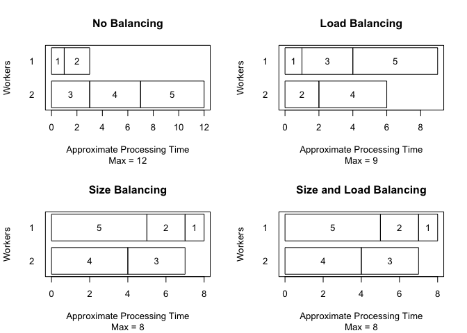

Other considerations
================

## What is going on inside jags.fit

``` r
library(dclone)
```

    ## Loading required package: coda

    ## Loading required package: parallel

    ## Loading required package: Matrix

    ## dclone 2.3-1      2023-04-07

``` r
n = 30
X1 = rnorm(n)
X = model.matrix(~X1)
beta.true = c(0.5, 1)
link_mu = X %*% beta.true

# Linear regression model
mu = link_mu
sigma.e = 1
Y = rnorm(n,mean=mu,sd=sigma.e)

Normal.model = function(){
  # Likelihood 
  for (i in 1:n){
    mu[i] <- X[i,] %*% beta
    Y[i] ~ dnorm(mu[i],prec.e)
  }
  # Prior
  beta[1] ~ dnorm(0, 1)
  beta[2] ~ dnorm(0, 1)
  prec.e ~ dlnorm(0, 1)
}

dat = list(Y=Y, X=X, n=n)

Normal.Bayes = jags.fit(data=dat, params=c("beta","prec.e"), model=Normal.model)
```

    ## Registered S3 method overwritten by 'R2WinBUGS':
    ##   method            from  
    ##   as.mcmc.list.bugs dclone

    ## Compiling model graph
    ##    Resolving undeclared variables
    ##    Allocating nodes
    ## Graph information:
    ##    Observed stochastic nodes: 30
    ##    Unobserved stochastic nodes: 3
    ##    Total graph size: 157
    ## 
    ## Initializing model

What just happened? `jags.fit` is a wrapper around some rjags functions.

``` r
m <- jagsModel(file = Normal.model, data=dat, n.chains=3)
```

    ## Compiling model graph
    ##    Resolving undeclared variables
    ##    Allocating nodes
    ## Graph information:
    ##    Observed stochastic nodes: 30
    ##    Unobserved stochastic nodes: 3
    ##    Total graph size: 157
    ## 
    ## Initializing model

``` r
m
```

    ## JAGS model:
    ## 
    ## model
    ## {
    ##     for (i in 1:n) {
    ##         mu[i] <- X[i, ] %*% beta
    ##         Y[i] ~ dnorm(mu[i], prec.e)
    ##     }
    ##     beta[1] ~ dnorm(0.00000E+00, 1)
    ##     beta[2] ~ dnorm(0.00000E+00, 1)
    ##     prec.e ~ dlnorm(0.00000E+00, 1)
    ## }
    ## Fully observed variables:
    ##  X Y n

``` r
str(m)
```

    ## List of 8
    ##  $ ptr      :function ()  
    ##  $ data     :function ()  
    ##  $ model    :function ()  
    ##  $ state    :function (internal = FALSE)  
    ##  $ nchain   :function ()  
    ##  $ iter     :function ()  
    ##  $ sync     :function ()  
    ##  $ recompile:function ()  
    ##  - attr(*, "class")= chr "jags"

``` r
str(m$state())
```

    ## List of 3
    ##  $ :List of 2
    ##   ..$ beta  : num [1:2] 0.547 0.835
    ##   ..$ prec.e: num 0.841
    ##  $ :List of 2
    ##   ..$ beta  : num [1:2] 0.19 1.22
    ##   ..$ prec.e: num 0.769
    ##  $ :List of 2
    ##   ..$ beta  : num [1:2] 0.386 1.062
    ##   ..$ prec.e: num 1.04

``` r
m$iter()
```

    ## [1] 1000

``` r
update(m, n.iter=1000)
str(m$state())
```

    ## List of 3
    ##  $ :List of 2
    ##   ..$ beta  : num [1:2] 0.59 0.938
    ##   ..$ prec.e: num 0.995
    ##  $ :List of 2
    ##   ..$ beta  : num [1:2] 0.55 1.37
    ##   ..$ prec.e: num 1.01
    ##  $ :List of 2
    ##   ..$ beta  : num [1:2] 0.384 0.855
    ##   ..$ prec.e: num 0.986

``` r
m$iter()
```

    ## [1] 2000

``` r
s = codaSamples(m, variable.names=c("beta","prec.e"), n.iter=5000)
str(s)
```

    ## List of 3
    ##  $ : 'mcmc' num [1:5000, 1:3] 0.199 0.555 0.466 0.418 0.552 ...
    ##   ..- attr(*, "dimnames")=List of 2
    ##   .. ..$ : NULL
    ##   .. ..$ : chr [1:3] "beta[1]" "beta[2]" "prec.e"
    ##   ..- attr(*, "mcpar")= num [1:3] 2001 7000 1
    ##  $ : 'mcmc' num [1:5000, 1:3] 0.643 0.395 0.271 0.355 0.18 ...
    ##   ..- attr(*, "dimnames")=List of 2
    ##   .. ..$ : NULL
    ##   .. ..$ : chr [1:3] "beta[1]" "beta[2]" "prec.e"
    ##   ..- attr(*, "mcpar")= num [1:3] 2001 7000 1
    ##  $ : 'mcmc' num [1:5000, 1:3] 0.657 0.514 0.283 0.557 0.524 ...
    ##   ..- attr(*, "dimnames")=List of 2
    ##   .. ..$ : NULL
    ##   .. ..$ : chr [1:3] "beta[1]" "beta[2]" "prec.e"
    ##   ..- attr(*, "mcpar")= num [1:3] 2001 7000 1
    ##  - attr(*, "class")= chr "mcmc.list"

``` r
head(s)
```

    ## [[1]]
    ## Markov Chain Monte Carlo (MCMC) output:
    ## Start = 2001 
    ## End = 2007 
    ## Thinning interval = 1 
    ##           beta[1]   beta[2]    prec.e
    ## [1,]  0.199270379 1.0178185 0.6587250
    ## [2,]  0.554616540 1.3837836 0.6374262
    ## [3,]  0.465798713 0.9647915 0.9425767
    ## [4,]  0.418135174 0.7030135 0.7106731
    ## [5,]  0.552463897 0.9722941 1.1675779
    ## [6,] -0.004634854 0.8368509 1.0048085
    ## [7,]  0.455662692 0.7723796 1.0260818
    ## 
    ## [[2]]
    ## Markov Chain Monte Carlo (MCMC) output:
    ## Start = 2001 
    ## End = 2007 
    ## Thinning interval = 1 
    ##        beta[1]   beta[2]    prec.e
    ## [1,] 0.6431968 1.3704992 0.6007487
    ## [2,] 0.3954755 0.7469872 1.2802107
    ## [3,] 0.2713566 0.8184008 0.7105771
    ## [4,] 0.3554010 0.5266038 1.1567306
    ## [5,] 0.1804431 0.8881939 0.9111808
    ## [6,] 0.7995524 0.9422969 0.9604717
    ## [7,] 0.6194117 1.0843992 0.9898079
    ## 
    ## [[3]]
    ## Markov Chain Monte Carlo (MCMC) output:
    ## Start = 2001 
    ## End = 2007 
    ## Thinning interval = 1 
    ##        beta[1]   beta[2]    prec.e
    ## [1,] 0.6571342 0.8477539 1.0463573
    ## [2,] 0.5137587 1.1390626 1.0548336
    ## [3,] 0.2833118 0.9642532 0.9560634
    ## [4,] 0.5565852 0.9769870 0.8989111
    ## [5,] 0.5243251 1.0545215 1.4858025
    ## [6,] 0.6914973 1.1074321 1.3235825
    ## [7,] 0.4800434 1.0766994 0.7125172

``` r
m$iter()
```

    ## [1] 7000

``` r
update(m, n.iter=1000)
m$iter()
```

    ## [1] 8000

``` r
s = codaSamples(m, variable.names=c("beta","prec.e"), n.iter=5000)
head(s)
```

    ## [[1]]
    ## Markov Chain Monte Carlo (MCMC) output:
    ## Start = 8001 
    ## End = 8007 
    ## Thinning interval = 1 
    ##        beta[1]   beta[2]    prec.e
    ## [1,] 0.5372080 0.8370752 0.6915102
    ## [2,] 0.5926880 0.4711099 0.9700360
    ## [3,] 0.3881598 1.0967369 0.6862398
    ## [4,] 0.3185140 1.0068155 1.2582990
    ## [5,] 0.3788555 0.7409834 1.5261354
    ## [6,] 0.5467354 0.8440434 1.1278314
    ## [7,] 0.5707026 0.9213633 1.0186560
    ## 
    ## [[2]]
    ## Markov Chain Monte Carlo (MCMC) output:
    ## Start = 8001 
    ## End = 8007 
    ## Thinning interval = 1 
    ##        beta[1]    beta[2]    prec.e
    ## [1,] 0.4057188 0.63475726 1.0061430
    ## [2,] 0.4825517 0.91217978 1.1351150
    ## [3,] 1.0206992 0.63681133 0.3708245
    ## [4,] 0.8653148 1.21613834 0.3678927
    ## [5,] 0.9590852 1.01769718 0.4097857
    ## [6,] 0.6146061 0.03458438 0.4460293
    ## [7,] 0.5473222 0.72765677 0.6816414
    ## 
    ## [[3]]
    ## Markov Chain Monte Carlo (MCMC) output:
    ## Start = 8001 
    ## End = 8007 
    ## Thinning interval = 1 
    ##        beta[1]   beta[2]    prec.e
    ## [1,] 0.4507434 1.1269333 1.1255387
    ## [2,] 0.6250908 1.0700716 0.9719621
    ## [3,] 0.5543428 0.8372496 0.8378620
    ## [4,] 0.2745926 0.6052781 0.8435711
    ## [5,] 0.2530100 0.8669130 1.2434955
    ## [6,] 0.5194152 0.9855910 0.7905318
    ## [7,] 0.7382783 0.8875974 0.8242796

``` r
m$iter()
```

    ## [1] 13000

Can we further update `Normal.Bayes`?

``` r
m2 <- updated.model(Normal.Bayes)
m2$iter()
```

    ## [1] 7000

``` r
update(m2, n.iter=1000)
m2$iter()
```

    ## [1] 8000

Couple of things to cover here:

``` r
str(formals(jags.fit))
```

    ## Dotted pair list of 11
    ##  $ data         : symbol 
    ##  $ params       : symbol 
    ##  $ model        : symbol 
    ##  $ inits        : NULL
    ##  $ n.chains     : num 3
    ##  $ n.adapt      : num 1000
    ##  $ n.update     : num 1000
    ##  $ thin         : num 1
    ##  $ n.iter       : num 5000
    ##  $ updated.model: logi TRUE
    ##  $ ...          : symbol

Implicitly, we do:

``` r
Normal.Bayes = jags.fit(
    data=dat, 
    params=c("beta","prec.e"),
    model=Normal.model,
    inits=NULL,
    n.chains=3,
    n.adapt=1000,
    n.update=1000,
    thin=1,
    n.iter=5000,
    updated.model=TRUE)
```

    ## Compiling model graph
    ##    Resolving undeclared variables
    ##    Allocating nodes
    ## Graph information:
    ##    Observed stochastic nodes: 30
    ##    Unobserved stochastic nodes: 3
    ##    Total graph size: 157
    ## 
    ## Initializing model

## Working with MCMC lists

``` r
mcmcapply(Normal.Bayes, sd)
```

    ##   beta[1]   beta[2]    prec.e 
    ## 0.1933961 0.2118606 0.2402454

``` r
mcmcapply(Normal.Bayes, quantile, c(0.05, 0.5, 0.95))
```

    ##       beta[1]   beta[2]    prec.e
    ## 5%  0.1355760 0.6273773 0.5719315
    ## 50% 0.4559983 0.9752662 0.9003513
    ## 95% 0.7710332 1.3166373 1.3531091

``` r
quantile(Normal.Bayes, c(0.05, 0.5, 0.95))
```

    ##       beta[1]   beta[2]    prec.e
    ## 5%  0.1355760 0.6273773 0.5719315
    ## 50% 0.4559983 0.9752662 0.9003513
    ## 95% 0.7710332 1.3166373 1.3531091

``` r
str(as.matrix(Normal.Bayes))
```

    ##  num [1:15000, 1:3] 0.243 0.632 0.662 0.469 0.298 ...
    ##  - attr(*, "dimnames")=List of 2
    ##   ..$ : NULL
    ##   ..$ : chr [1:3] "beta[1]" "beta[2]" "prec.e"

## We need to talk about RNGs

``` r
library(rjags)
```

    ## Linked to JAGS 4.3.1

    ## Loaded modules: basemod,bugs

``` r
str(parallel.seeds("base::BaseRNG", 5))
```

    ## List of 5
    ##  $ :List of 2
    ##   ..$ .RNG.name : chr "base::Marsaglia-Multicarry"
    ##   ..$ .RNG.state: int [1:2] 665201691 1167961748
    ##  $ :List of 2
    ##   ..$ .RNG.name : chr "base::Super-Duper"
    ##   ..$ .RNG.state: int [1:2] -1423190571 2121713683
    ##  $ :List of 2
    ##   ..$ .RNG.name : chr "base::Mersenne-Twister"
    ##   ..$ .RNG.state: int [1:625] 1 -2044254691 889249431 576935934 -2048973896 707018651 -139762183 440395080 1305325686 -567214671 ...
    ##  $ :List of 2
    ##   ..$ .RNG.name : chr "base::Wichmann-Hill"
    ##   ..$ .RNG.state: int [1:3] 10700 17112 9639
    ##  $ :List of 2
    ##   ..$ .RNG.name : chr "base::Marsaglia-Multicarry"
    ##   ..$ .RNG.state: int [1:2] 1956963634 749094759

``` r
## The lecuyer module provides the RngStream factory, which allows large
## numbers of independent parallel RNGs to be generated. 
load.module("lecuyer")
```

    ## module lecuyer loaded

``` r
list.factories(type="rng")
```

    ##              factory status
    ## 1 lecuyer::RngStream   TRUE
    ## 2      base::BaseRNG   TRUE

``` r
str(parallel.seeds("lecuyer::RngStream", 5))
```

    ## List of 5
    ##  $ :List of 2
    ##   ..$ .RNG.name : chr "lecuyer::RngStream"
    ##   ..$ .RNG.state: int [1:6] 816212465 708574135 -1952243475 2132686611 -958244951 1002551343
    ##  $ :List of 2
    ##   ..$ .RNG.name : chr "lecuyer::RngStream"
    ##   ..$ .RNG.state: int [1:6] 437877334 1619597123 867310394 -671062179 593795374 1576713586
    ##  $ :List of 2
    ##   ..$ .RNG.name : chr "lecuyer::RngStream"
    ##   ..$ .RNG.state: int [1:6] 1239692836 -1103189500 -226214239 1900168471 -659221097 526979336
    ##  $ :List of 2
    ##   ..$ .RNG.name : chr "lecuyer::RngStream"
    ##   ..$ .RNG.state: int [1:6] -250719815 -851163807 1998641742 1164743725 -149672441 230567362
    ##  $ :List of 2
    ##   ..$ .RNG.name : chr "lecuyer::RngStream"
    ##   ..$ .RNG.state: int [1:6] 1800505163 -23938180 1542491044 -2024225142 2007627358 1748705733

## Can we run chains in parallel?

``` r
system.time({
    Normal.Bayes = jags.fit(
        data=dat, params=c("beta","prec.e"), model=Normal.model,
        n.chains=4,
        n.update=10^6)
})
```

    ## Compiling model graph
    ##    Resolving undeclared variables
    ##    Allocating nodes
    ## Graph information:
    ##    Observed stochastic nodes: 30
    ##    Unobserved stochastic nodes: 3
    ##    Total graph size: 157
    ## 
    ## Initializing model

    ##    user  system elapsed 
    ##  18.856   0.039  18.900

``` r
system.time({
    Normal.Bayes = jags.parfit(
        cl=10,
        data=dat, params=c("beta","prec.e"), model=Normal.model,
        n.chains=4,
        n.update=10^6)
})
```

    ## 
    ## Parallel computation in progress

    ##    user  system elapsed 
    ##  19.513   0.080   4.943

## I like DC but I don’t have time …

Well, check `dc.parfit`

``` r
## determine the number of workers needed
clusterSize(1:5)
```

    ##   workers none load size both
    ## 1       1   15   15   15   15
    ## 2       2   12    9    8    8
    ## 3       3    9    7    5    5
    ## 4       4    7    6    5    5
    ## 5       5    5    5    5    5

``` r
## visually compare balancing options
opar <- par(mfrow=c(2, 2))
plotClusterSize(2,1:5, "none")
plotClusterSize(2,1:5, "load")
plotClusterSize(2,1:5, "size")
plotClusterSize(2,1:5, "both")
```

<!-- -->

``` r
par(opar)
```

Parallel chains, size balancing, both.
