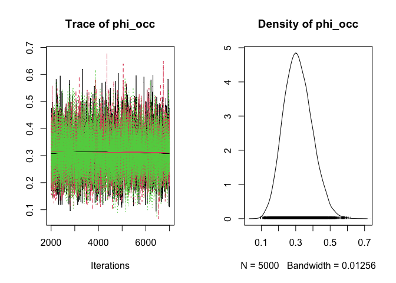
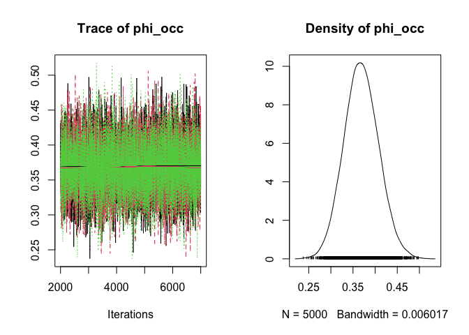
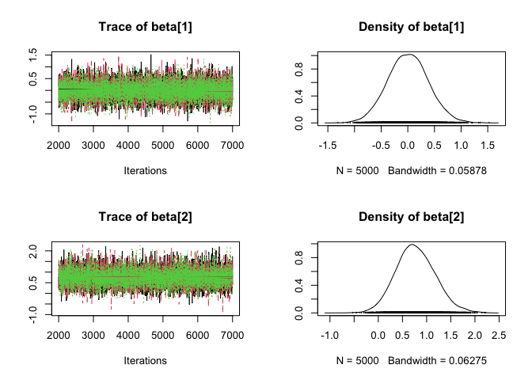
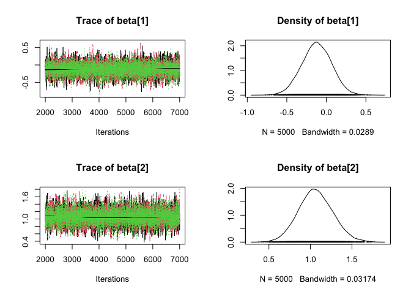
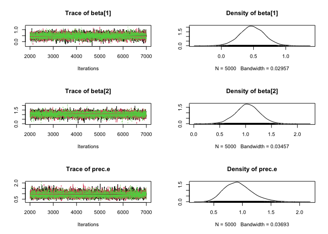
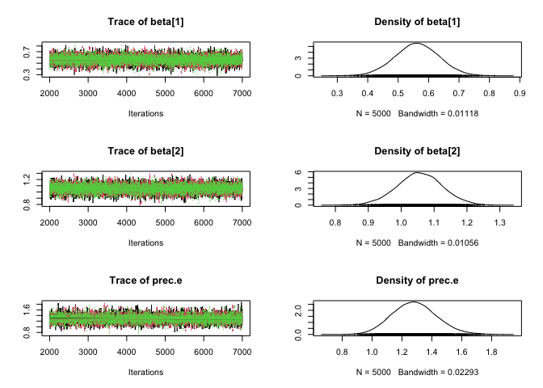
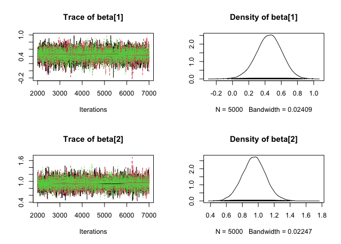
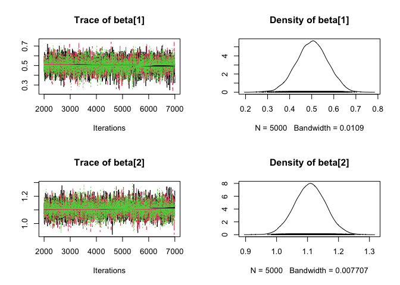

Statistical and computational preliminaries
================

## Introduction

In the first part of the course, we will go over some statistical
preliminaries and corrresponding computational aspects. We will learn:

1.  To write down a likelihood function
2.  Meaning of the likelihood function
3.  Meaning of the Maximum likelihood estimator, difference between a
    parameter, an estimator and an estimate
4.  Good properties of an estimator: Consistency, Asymptotic normality,
    Unbiasedness, Mean squared error
5.  Frequentist paradigm and quantification of uncertainty
6.  How to use Fisher information for an approximate quantification of
    uncertainty
7.  Motivation for the Bayesian paradigm
8.  Meaning of the prior distribution
9.  Derivation and meaning of the posterior distribution
10. Interpretation of a credible interval and a confidence interval
11. Scope of inference: Should I specify the hypothetical experiment or
    should I specify the prior distribution? Each one comes with its own
    scope of inference.

## Occupancy studies

Let us start with an occupancy study. Suppose we have a site that is
being considered for development. There is a species of interest that
might get affected by this development. Hence we need to study what
proportion of the area is occupied by the species of interest. If this
proportion is not very large, we may go ahead with the development.

Suppose we divide the site in several equal area cells. Suppose all
cells have similar habitats (identical). Further we assume that
occupancy of one cell does not affect occupancy of other quadrats
(independence). Let  be
the total number of cells.

Let  be the
occupancy status of the i-th quadrat. This is unknown and hence is a
random variable. It takes values in
, 0
meaning unoccupied and 1 meaning occupied. This is a Bernoulli random
variable. We denote this by
").
The random variable 
takes value 1 with probability
. This is the
probability of occupancy. The value of
 is unknown.
This is the parameter of the distribution.

Suppose we visit , a
subset, of these cells. These are selected using simple random sampling
without replacement. The observations are denoted by
.
We can use these to infer about the unknown parameter
. The main
tool for such inductive inference (data to population and *not*
hypothesis to prediction) is the likelihood function.

### The likelihood function

Suppose the observed data are \${0,1,1,0,0}. Then we can compute the
probabiity of observing these data under various values of the parameter
 (assuming
independent, identically distributed Bernoulli random variables). It can
be written as:
={\prod}P(y_{i};\phi)={\prod}\phi^{y_{i}}(1-\phi)^{1-y_{i}}")

Notice that this is a function of the parameter
 and the data
are fixed. The likelihood function or equivalently the log-likelihood
function quantifies the *relative* support for different values of the
parameters. Hence only the likelihood ratio function is meaningful.

### Maximum likelihood estimator

A natural approach to estimation (inference) of
 is to choose
the value that is better supported than any other value in the parameter
space
"). This
is called the maximum likelihood estimator. We can show that this turns
out to be:


This is called an ‘estimate’. This is a fixed quantity because the data
are observed and hence not random.

### Quantification of uncertainty

As scientists, would you stop at reporting this? I suspect not. If this
estimate is large,say 0.85, the developer is going to say ‘you just got
lucky (or, worse, you cheated) with your particular sample’. A natural
question to ask then is ‘how different this estimate would have been if
someone else had conducted the experiment?’. In this case, the
‘experiment to be repeated’ is fairly uncontroversial. We take another
simple random sample without replacement from the study area. However,
that is not always the case as we will see when we deal with the
regression model.

Sampling distribution is the distribution of the estimates that one
would have obtained had one conducted these replicate experiments. It is
possible to get an approximation to this sampling distribution in a very
general fashion if we use the method of maximum likelihood estimator. In
many situations, it can be shown that the sampling distribution is:

)")

where

=-\frac{1}{n}\sum\frac{d^2}{d^2\phi}logL(\phi;{y})")

This is also called the Hessian matrix or the curvature matrix of the
log-likelihood function. Higher the curvature, less variable are the
estimates from one experiment to other. Hence the resultant ‘estimate’
is considered highly reliable.

### 95% Confidence interval

This is just a set of values that covers the estimates from 95% of the
experiments. The experiments are not actually replicated and hence this
simply tells us what the various outcomes could be. Our decisions could
be based on this variation *as long as we all agree on the experiment
that could be replicated*. We are simply covering our bases against the
various outcomes and protect ourselves from future challenges. If we use
the maximum likelihood estimator, we can obtain this as:

},\hat{\phi}+\frac{1.96}{n}\sqrt{I^{-1}(\hat{\phi})}")

You will notice that as we increase the sample size, the width of this
interval converges to zero. That is, as we increase the sample size, the
MLE converges to the true parameter value. This is called the
‘consistency’ of an estimator. This is an essential property of any
statistical inferential procedure.

Note: These are extremely loose statements. For proper mathematical
statements, you can see our ‘future’ book.

## Bayesian paradigm

All the above statements seem logical but fake at the same time! No one
repeats the same experiment (although replication consistency is an
essential scientific requirement)! What if we have time series? We can
never replicate a time series. So then should we simply take the
estimated value *prima facie*? That also seems incorrect scientifically.
So where is the uncertainty in our mind coming from? According to the
Bayesian paradigm, it arises because of our ‘personal’ uncertainty about
the parameter values.

*Prior distribution*: Suppose we have some idea about what values of
occupancy are more likely than others *before* any data are collected.
This can be quantified as a probability distribution on the parameter
space
"). This
distribution can be anything, unimodal or bimodal or even multimodal!
Let us denote this by
").
How do we change this *after* we observe the data?

*Posterior distribution* This is the quantification of uncertainty
*after* we observe the data. Usually observing the data decreases our
uncertainty, although it is not guaranteed to be the case. The posterior
distribution is obtained by:

=\frac{L(\phi;y)\pi(\phi)}{\int L(\phi;d\phi y)\pi(\phi)}")

### Credible interval

This is obtained by using the percentiles of the posterior distribution.

Notice a few things here.

1.  This involves an integral in the denominator. Depending on how many
    parameters (unknowns) are in the model, this can be a large
    dimensional integral. Imagine a regression model with 5 covariates.
    This integral will be 6 dimensional (add one for the variance).
2.  Data are fixed. We do not need to replicate the experiment. The
    uncertainty is completely in the mind of the researcher.
3.  Different researchers might have different prior uncertainties. This
    will lead to different posterior uncertainties. Hence this is a
    subjective or personal quantification of uncertainty. It is not
    transferable from one researcher to another.

An interesting result follows, however. As we increase the samples size,
the Bayesian posterior, for ANY prior, converges to the distribution
that looks very much like the frequentist sampling distribution of the
MLE. That is,

\thickapprox N(\hat{\phi},\frac{1}{n}I^{-1}(\hat{\phi}))")

There are subtle differences that we are going to ignore here.
Qualitatively, what it says is that for large sample size,

1.  Posterior mean and the MLE are similar
2.  Posterior variance is similar to the inverse of the Hessian matrix.

Hence credible interval and confidence intervals will be
indistinguishable for large sample size. Effect of the choice of the
prior distribution vanishes. How large a sample size should be for this
to happen? It depends on the number of parameters in the model and how
strong the prior distribution is.

## No math please!

> Bayesian and ML inference using MCMC and data cloning

We now show how one can compute the posterior distribution for any
choice of the prior distribution without analytically calculating the
integral in the denominator. We will generate the data under the
Bernoulli model. You can change the parameters as you wish when you run
the code.

``` r
library(dclone)
```

    ## Loading required package: coda

    ## Loading required package: parallel

    ## Loading required package: Matrix

    ## dclone 2.3-1      2022-07-11

``` r
phi.true = 0.3
n = 30
Y = rbinom(n,1,phi.true)

# Analytical MLE
MLE.est = sum(Y)/n    

# Bayesian inference using JAGS and dclone

# Step 1: WE need to define the model function. This is the critical component. 

Occ.model = function(){
  # Likelihood 
  for (i in 1:n){
    Y[i] ~ dbin(phi_occ,1)
  }
  # Prior
  phi_occ ~ dbeta(1,1)
}

# Now we need to provide the data to the model and generate random numbers from the posterior. We will discuss different options later. 

dat = list(Y=Y,n=n)
Occ.Bayes = jags.fit(dat,"phi_occ",Occ.model)
```

    ## Registered S3 method overwritten by 'R2WinBUGS':
    ##   method            from  
    ##   as.mcmc.list.bugs dclone

    ## Compiling model graph
    ##    Resolving undeclared variables
    ##    Allocating nodes
    ## Graph information:
    ##    Observed stochastic nodes: 30
    ##    Unobserved stochastic nodes: 1
    ##    Total graph size: 33
    ## 
    ## Initializing model

``` r
summary(Occ.Bayes)
```

    ## 
    ## Iterations = 2001:7000
    ## Thinning interval = 1 
    ## Number of chains = 3 
    ## Sample size per chain = 5000 
    ## 
    ## 1. Empirical mean and standard deviation for each variable,
    ##    plus standard error of the mean:
    ## 
    ##           Mean             SD       Naive SE Time-series SE 
    ##      0.3131700      0.0810679      0.0006619      0.0008718 
    ## 
    ## 2. Quantiles for each variable:
    ## 
    ##   2.5%    25%    50%    75%  97.5% 
    ## 0.1669 0.2554 0.3091 0.3663 0.4802

``` r
plot(Occ.Bayes)
```

<!-- -->

This was quite easy. Now we use data cloning to compute the MLE and its
variance using MCMC.

## Data cloning in a nutshell

As you all know, at least in this simple situation, we can write down
the likelihood function analytically. We can also use calculus and/or
numerical optimization such as the ‘optim’ function in R to get the
location of the maximum and its Hessian matrix. But suppose we do not
want to go through all of that and instead want to use the MCMC
algorithm. Why? Because it is easy and can be generalized to
hierarchical models.

Earlier we noted that as we increase the sample size, the Bayesian
posterior converges to the sampling distribution of the MLE. We,
obviously, cannot increase the sample size. The data are given to us.
Data cloning conducts a computational trick to increase the sample size.
We clone the data!

Imagine a sequence of K independent researchers.

Step 1: First researcher has data
.
They use their own prior and obtain the posterior distribution.

Step 2: Second researcher goes out and gets their own data. It just so
happens that they observed the same exact locations as the first
researcher. Being a good Bayesian, they use the posterior of the first
researcher as their prior (knowledge accumulation). The posterior for
the second researcher is given by:

Step K: The K-th researcher also obtains the same data but uses the
posterior at the (K-1) step as their prior.

What is happening with these sequential posterior distributions?

*The posterior distribution is converging to a single point; a
degenerate distribution. This is identical to the MLE!*

1.  As we increase the number of clones, the mean of the posterior
    distributions converges to the MLE.
2.  The variance of the posterior distribution converges to 0.
3.  If we scale the posterior distribution with the number of clones
    (that is, multiply the posterior variance by the number of clones),
    it is identical to the inverse of the Fisher information matrix.

We do not need to implement this procedure sequentially. The matrix of
these K datasets is of dimension
") with
identical columns.

![\left\[\begin{array}{cccccccccc} y\_{1} & y\_{1} & y\_{1} & y\_{1} & y\_{1} & y\_{1} & y\_{1} & y\_{1} & y\_{1} & y\_{1}\\ y\_{2} & y\_{2} & y\_{2} & y\_{2} & y\_{2} & y\_{2} & y\_{2} & y\_{2} & y\_{2} & y\_{2}\\ y\_{3} & y\_{3} & y\_{3} & y\_{3} & y\_{3} & y\_{3} & y\_{3} & y\_{3} & y\_{3} & y\_{3}\\ y\_{4} & y\_{4} & y\_{4} & y\_{4} & y\_{4} & y\_{4} & y\_{4} & y\_{4} & y\_{4} & y\_{4}\\ y\_{5} & y\_{5} & y\_{5} & y\_{5} & y\_{5} & y\_{5} & y\_{5} & y\_{5} & y\_{5} & y\_{5} \end{array}\right\]](https://latex.codecogs.com/svg.image?%5Cleft%5B%5Cbegin%7Barray%7D%7Bcccccccccc%7D%20y_%7B1%7D%20%26%20y_%7B1%7D%20%26%20y_%7B1%7D%20%26%20y_%7B1%7D%20%26%20y_%7B1%7D%20%26%20y_%7B1%7D%20%26%20y_%7B1%7D%20%26%20y_%7B1%7D%20%26%20y_%7B1%7D%20%26%20y_%7B1%7D%5C%5C%20y_%7B2%7D%20%26%20y_%7B2%7D%20%26%20y_%7B2%7D%20%26%20y_%7B2%7D%20%26%20y_%7B2%7D%20%26%20y_%7B2%7D%20%26%20y_%7B2%7D%20%26%20y_%7B2%7D%20%26%20y_%7B2%7D%20%26%20y_%7B2%7D%5C%5C%20y_%7B3%7D%20%26%20y_%7B3%7D%20%26%20y_%7B3%7D%20%26%20y_%7B3%7D%20%26%20y_%7B3%7D%20%26%20y_%7B3%7D%20%26%20y_%7B3%7D%20%26%20y_%7B3%7D%20%26%20y_%7B3%7D%20%26%20y_%7B3%7D%5C%5C%20y_%7B4%7D%20%26%20y_%7B4%7D%20%26%20y_%7B4%7D%20%26%20y_%7B4%7D%20%26%20y_%7B4%7D%20%26%20y_%7B4%7D%20%26%20y_%7B4%7D%20%26%20y_%7B4%7D%20%26%20y_%7B4%7D%20%26%20y_%7B4%7D%5C%5C%20y_%7B5%7D%20%26%20y_%7B5%7D%20%26%20y_%7B5%7D%20%26%20y_%7B5%7D%20%26%20y_%7B5%7D%20%26%20y_%7B5%7D%20%26%20y_%7B5%7D%20%26%20y_%7B5%7D%20%26%20y_%7B5%7D%20%26%20y_%7B5%7D%20%5Cend%7Barray%7D%5Cright%5D "\left[\begin{array}{cccccccccc} y_{1} & y_{1} & y_{1} & y_{1} & y_{1} & y_{1} & y_{1} & y_{1} & y_{1} & y_{1}\\ y_{2} & y_{2} & y_{2} & y_{2} & y_{2} & y_{2} & y_{2} & y_{2} & y_{2} & y_{2}\\ y_{3} & y_{3} & y_{3} & y_{3} & y_{3} & y_{3} & y_{3} & y_{3} & y_{3} & y_{3}\\ y_{4} & y_{4} & y_{4} & y_{4} & y_{4} & y_{4} & y_{4} & y_{4} & y_{4} & y_{4}\\ y_{5} & y_{5} & y_{5} & y_{5} & y_{5} & y_{5} & y_{5} & y_{5} & y_{5} & y_{5} \end{array}\right]")

We use the Bayesian procedure to analyze these data. The model function
used previously can be used with a minor modification to do this.

``` r
Occ.model.dc = function(){
  # Likelihood 
  
  for(k in 1:ncl){
  for (i in 1:n){
    Y[i,k] ~ dbin(phi_occ,1)
  }}
  # Prior
  phi_occ ~ dbeta(1,1)
}

# We need to turn the original data into an array. 
Y = array(Y,c(n,1))
Y = dcdim(Y)
# Need to add another index 'ncl' for the cloned dimension. It gets multiplied by the number of clones.
dat = list(Y=Y,n=n,ncl=1)
dclone(Y,2)
```

    ##       clone.1 clone.2
    ##  [1,]       0       0
    ##  [2,]       0       0
    ##  [3,]       0       0
    ##  [4,]       0       0
    ##  [5,]       0       0
    ##  [6,]       0       0
    ##  [7,]       0       0
    ##  [8,]       1       1
    ##  [9,]       1       1
    ## [10,]       0       0
    ## [11,]       1       1
    ## [12,]       0       0
    ## [13,]       0       0
    ## [14,]       1       1
    ## [15,]       1       1
    ## [16,]       0       0
    ## [17,]       1       1
    ## [18,]       0       0
    ## [19,]       0       0
    ## [20,]       0       0
    ## [21,]       0       0
    ## [22,]       1       1
    ## [23,]       0       0
    ## [24,]       0       0
    ## [25,]       1       1
    ## [26,]       0       0
    ## [27,]       0       0
    ## [28,]       0       0
    ## [29,]       0       0
    ## [30,]       1       1
    ## attr(,"n.clones")
    ## [1] 2
    ## attr(,"n.clones")attr(,"method")
    ## [1] "dim"
    ## attr(,"n.clones")attr(,"method")attr(,"drop")
    ## [1] TRUE

``` r
dclone(dat,2) 
```

    ## $Y
    ##       clone.1 clone.2
    ##  [1,]       0       0
    ##  [2,]       0       0
    ##  [3,]       0       0
    ##  [4,]       0       0
    ##  [5,]       0       0
    ##  [6,]       0       0
    ##  [7,]       0       0
    ##  [8,]       1       1
    ##  [9,]       1       1
    ## [10,]       0       0
    ## [11,]       1       1
    ## [12,]       0       0
    ## [13,]       0       0
    ## [14,]       1       1
    ## [15,]       1       1
    ## [16,]       0       0
    ## [17,]       1       1
    ## [18,]       0       0
    ## [19,]       0       0
    ## [20,]       0       0
    ## [21,]       0       0
    ## [22,]       1       1
    ## [23,]       0       0
    ## [24,]       0       0
    ## [25,]       1       1
    ## [26,]       0       0
    ## [27,]       0       0
    ## [28,]       0       0
    ## [29,]       0       0
    ## [30,]       1       1
    ## attr(,"n.clones")
    ## [1] 2
    ## attr(,"n.clones")attr(,"method")
    ## [1] "dim"
    ## attr(,"n.clones")attr(,"method")attr(,"drop")
    ## [1] TRUE
    ## 
    ## $n
    ## [1] 30 30
    ## attr(,"n.clones")
    ## [1] 2
    ## attr(,"n.clones")attr(,"method")
    ## [1] "rep"
    ## 
    ## $ncl
    ## [1] 1 1
    ## attr(,"n.clones")
    ## [1] 2
    ## attr(,"n.clones")attr(,"method")
    ## [1] "rep"

``` r
# Notice that this changes n also. We do not want that.
dclone(dat,2, unchanged="n",multiply="ncl")
```

    ## $Y
    ##       clone.1 clone.2
    ##  [1,]       0       0
    ##  [2,]       0       0
    ##  [3,]       0       0
    ##  [4,]       0       0
    ##  [5,]       0       0
    ##  [6,]       0       0
    ##  [7,]       0       0
    ##  [8,]       1       1
    ##  [9,]       1       1
    ## [10,]       0       0
    ## [11,]       1       1
    ## [12,]       0       0
    ## [13,]       0       0
    ## [14,]       1       1
    ## [15,]       1       1
    ## [16,]       0       0
    ## [17,]       1       1
    ## [18,]       0       0
    ## [19,]       0       0
    ## [20,]       0       0
    ## [21,]       0       0
    ## [22,]       1       1
    ## [23,]       0       0
    ## [24,]       0       0
    ## [25,]       1       1
    ## [26,]       0       0
    ## [27,]       0       0
    ## [28,]       0       0
    ## [29,]       0       0
    ## [30,]       1       1
    ## attr(,"n.clones")
    ## [1] 2
    ## attr(,"n.clones")attr(,"method")
    ## [1] "dim"
    ## attr(,"n.clones")attr(,"method")attr(,"drop")
    ## [1] TRUE
    ## 
    ## $n
    ## [1] 30
    ## 
    ## $ncl
    ## [1] 2
    ## attr(,"n.clones")
    ## [1] 2
    ## attr(,"n.clones")attr(,"method")
    ## [1] "multi"

``` r
Occ.DC = dc.fit(dat,"phi_occ",Occ.model.dc,n.clones=c(1,2,5),unchanged="n",multiply="ncl")
```

    ## 
    ## Fitting model with 1 clone 
    ## 
    ## Compiling model graph
    ##    Resolving undeclared variables
    ##    Allocating nodes
    ## Graph information:
    ##    Observed stochastic nodes: 30
    ##    Unobserved stochastic nodes: 1
    ##    Total graph size: 34
    ## 
    ## Initializing model
    ## 
    ## 
    ## Fitting model with 2 clones 
    ## 
    ## Compiling model graph
    ##    Resolving undeclared variables
    ##    Allocating nodes
    ## Graph information:
    ##    Observed stochastic nodes: 60
    ##    Unobserved stochastic nodes: 1
    ##    Total graph size: 64
    ## 
    ## Initializing model
    ## 
    ## 
    ## Fitting model with 5 clones 
    ## 
    ## Compiling model graph
    ##    Resolving undeclared variables
    ##    Allocating nodes
    ## Graph information:
    ##    Observed stochastic nodes: 150
    ##    Unobserved stochastic nodes: 1
    ##    Total graph size: 154
    ## 
    ## Initializing model

``` r
summary(Occ.DC)
```

    ## 
    ## Iterations = 2001:7000
    ## Thinning interval = 1 
    ## Number of chains = 3 
    ## Sample size per chain = 5000 
    ## Number of clones = 5
    ## 
    ## 1. Empirical mean and standard deviation for each variable,
    ##    plus standard error of the mean:
    ## 
    ##           Mean      SD DC SD.phi_occ  Naive SE Time-series SE R hat
    ## phi_occ 0.3027 0.03753       0.08393 0.0003065      0.0003973     1
    ## 
    ## 2. Quantiles for each variable:
    ## 
    ##   2.5%    25%    50%    75%  97.5% 
    ## 0.2312 0.2767 0.3018 0.3277 0.3786

``` r
plot(Occ.DC)
```

<!-- -->

## Regression models

Now we will generalize these models to account for covariates. We will
consider Logistic regression but also comment on how to change it to
Probit regression easily. Similarly we show how this basic prototype can
be modified to do linear and non-linear regression, Poisson regression
etc.

``` r
library(boot)
n = 30
X1 = rnorm(n)
X = model.matrix(~X1)
beta.true = c(0.5,1)
link_mu = X %*% beta.true

# Logistic regression model
phi_occ = inv.logit(link_mu)
Y = rbinom(n,1,phi_occ)

MLE.est = glm(Y ~ X1, family="binomial")
# Bayesian analysis

Occ.model = function(){
  # Likelihood 
  for (i in 1:n){
    phi_occ[i] <- ilogit(X[i,] %*% beta)
    Y[i] ~ dbin(phi_occ[i],1)
  }
  # Prior
  beta[1]~dnorm(0,1)
  beta[2]~dnorm(0,1)
}

# Now we need to provide the data to the model and generate random numbers from the posterior. We will discuss different options later. 

dat = list(Y=Y,X=X,n=n)
Occ.Bayes = jags.fit(dat,'beta',Occ.model)
```

    ## Compiling model graph
    ##    Resolving undeclared variables
    ##    Allocating nodes
    ## Graph information:
    ##    Observed stochastic nodes: 30
    ##    Unobserved stochastic nodes: 2
    ##    Total graph size: 186
    ## 
    ## Initializing model

``` r
summary(Occ.Bayes)
```

    ## 
    ## Iterations = 2001:7000
    ## Thinning interval = 1 
    ## Number of chains = 3 
    ## Sample size per chain = 5000 
    ## 
    ## 1. Empirical mean and standard deviation for each variable,
    ##    plus standard error of the mean:
    ## 
    ##             Mean     SD Naive SE Time-series SE
    ## beta[1] 0.006548 0.3803 0.003105       0.004198
    ## beta[2] 0.772665 0.4059 0.003314       0.004382
    ## 
    ## 2. Quantiles for each variable:
    ## 
    ##             2.5%     25%      50%    75%  97.5%
    ## beta[1] -0.72715 -0.2503 0.003628 0.2582 0.7617
    ## beta[2]  0.01515  0.4954 0.756365 1.0381 1.6125

``` r
plot(Occ.Bayes)
```

<!-- -->

``` r
# Now we modify this to get the MLE using data cloning.

Occ.model_dc = function(){
  # Likelihood 
  for (k in 1:ncl){
  for (i in 1:n){
    phi_occ[i,k] <- ilogit(X[i,,k] %*% beta)
    Y[i,k] ~ dbin(phi_occ[i,k],1)
  }}
  # Prior
  beta[1]~dnorm(0,1)
  beta[2]~dnorm(0,1)
}

# Now we need to provide the data to the model and generate random numbers from the posterior. We will discuss different options later. 

Y = array(Y,c(n,1))
X = array(X,c(dim(X),1))
Y = dcdim(Y)
X = dcdim(X)
dat = list(Y=Y,X=X,n=n, ncl=1)
Occ.DC = dc.fit(dat,'beta',Occ.model_dc,n.clones=c(1,2,5),unchanged="n",multiply="ncl")
```

    ## 
    ## Fitting model with 1 clone 
    ## 
    ## Compiling model graph
    ##    Resolving undeclared variables
    ##    Allocating nodes
    ## Graph information:
    ##    Observed stochastic nodes: 30
    ##    Unobserved stochastic nodes: 2
    ##    Total graph size: 187
    ## 
    ## Initializing model
    ## 
    ## 
    ## Fitting model with 2 clones 
    ## 
    ## Compiling model graph
    ##    Resolving undeclared variables
    ##    Allocating nodes
    ## Graph information:
    ##    Observed stochastic nodes: 60
    ##    Unobserved stochastic nodes: 2
    ##    Total graph size: 307
    ## 
    ## Initializing model
    ## 
    ## 
    ## Fitting model with 5 clones 
    ## 
    ## Compiling model graph
    ##    Resolving undeclared variables
    ##    Allocating nodes
    ## Graph information:
    ##    Observed stochastic nodes: 150
    ##    Unobserved stochastic nodes: 2
    ##    Total graph size: 667
    ## 
    ## Initializing model

``` r
summary(Occ.DC)
```

    ## 
    ## Iterations = 2001:7000
    ## Thinning interval = 1 
    ## Number of chains = 3 
    ## Sample size per chain = 5000 
    ## Number of clones = 5
    ## 
    ## 1. Empirical mean and standard deviation for each variable,
    ##    plus standard error of the mean:
    ## 
    ##            Mean     SD  DC SD Naive SE Time-series SE R hat
    ## beta[1] 0.01906 0.1778 0.3976 0.001452       0.001902     1
    ## beta[2] 0.83672 0.1963 0.4390 0.001603       0.002124     1
    ## 
    ## 2. Quantiles for each variable:
    ## 
    ##            2.5%      25%    50%    75%  97.5%
    ## beta[1] -0.3273 -0.09926 0.0174 0.1360 0.3752
    ## beta[2]  0.4776  0.70193 0.8297 0.9667 1.2413

``` r
plot(Occ.DC)
```

<!-- -->

We hope you can see the pattern in how we are changing the prototype
model function and the data function. If we want to do a Normal linear
regression and Poisson regression we can modify the regression program
above easily.

``` r
# Linear regression

n = 30
X1 = rnorm(n)
X = model.matrix(~X1)
beta.true = c(0.5,1)
link_mu = X %*% beta.true

# Linear regression model
mu = link_mu
sigma.e = 1
Y = rnorm(n,mean=mu,sd=sigma.e)

MLE.est = glm(Y ~ X1, family="gaussian")
# Bayesian analysis

Normal.model = function(){
  # Likelihood 
  for (i in 1:n){
    mu[i] <- X[i,] %*% beta
    Y[i] ~ dnorm(mu[i],prec.e)
  }
  # Prior
  beta[1]~dnorm(0,1)
  beta[2]~dnorm(0,1)
  prec.e ~ dlnorm(0,1)
}

# Now we need to provide the data to the model and generate random numbers from the posterior. We will discuss different options later. 

dat = list(Y=Y,X=X,n=n)
Normal.Bayes = jags.fit(dat,c("beta","prec.e"),Normal.model)
```

    ## Compiling model graph
    ##    Resolving undeclared variables
    ##    Allocating nodes
    ## Graph information:
    ##    Observed stochastic nodes: 30
    ##    Unobserved stochastic nodes: 3
    ##    Total graph size: 157
    ## 
    ## Initializing model

``` r
summary(Normal.Bayes)
```

    ## 
    ## Iterations = 2001:7000
    ## Thinning interval = 1 
    ## Number of chains = 3 
    ## Sample size per chain = 5000 
    ## 
    ## 1. Empirical mean and standard deviation for each variable,
    ##    plus standard error of the mean:
    ## 
    ##           Mean     SD Naive SE Time-series SE
    ## beta[1] 0.4784 0.1920 0.001568       0.001568
    ## beta[2] 1.0369 0.2299 0.001877       0.001917
    ## prec.e  0.9291 0.2397 0.001957       0.002659
    ## 
    ## 2. Quantiles for each variable:
    ## 
    ##           2.5%    25%    50%    75%  97.5%
    ## beta[1] 0.1002 0.3516 0.4765 0.6074 0.8577
    ## beta[2] 0.5823 0.8887 1.0384 1.1877 1.4856
    ## prec.e  0.5179 0.7576 0.9116 1.0771 1.4553

``` r
plot(Normal.Bayes)
```

<!-- -->

``` r
# Now we modify this to get the MLE using data cloning.

Normal.model_dc = function(){
  # Likelihood 
  for (k in 1:ncl){
  for (i in 1:n){
    mu[i,k] <- X[i,,k] %*% beta
    Y[i,k] ~ dnorm(mu[i,k],prec.e)
  }}
  # Prior
  beta[1]~dnorm(0,1)
  beta[2]~dnorm(0,1)
  prec.e ~ dlnorm(0,1)
}

# Now we need to provide the data to the model and generate random numbers from the posterior. We will discuss different options later. 

Y = array(Y,c(n,1))
X = array(X,c(dim(X),1))
Y = dcdim(Y)
X = dcdim(X)
dat = list(Y=Y,X=X,n=n, ncl=1)
Normal.DC = dc.fit(dat,c("beta","prec.e"),Normal.model_dc,n.clones=c(1,2,5),unchanged="n",multiply="ncl")
```

    ## 
    ## Fitting model with 1 clone 
    ## 
    ## Compiling model graph
    ##    Resolving undeclared variables
    ##    Allocating nodes
    ## Graph information:
    ##    Observed stochastic nodes: 30
    ##    Unobserved stochastic nodes: 3
    ##    Total graph size: 158
    ## 
    ## Initializing model
    ## 
    ## 
    ## Fitting model with 2 clones 
    ## 
    ## Compiling model graph
    ##    Resolving undeclared variables
    ##    Allocating nodes
    ## Graph information:
    ##    Observed stochastic nodes: 60
    ##    Unobserved stochastic nodes: 3
    ##    Total graph size: 278
    ## 
    ## Initializing model
    ## 
    ## 
    ## Fitting model with 5 clones 
    ## 
    ## Compiling model graph
    ##    Resolving undeclared variables
    ##    Allocating nodes
    ## Graph information:
    ##    Observed stochastic nodes: 150
    ##    Unobserved stochastic nodes: 3
    ##    Total graph size: 638
    ## 
    ## Initializing model

``` r
summary(Normal.DC)
```

    ## 
    ## Iterations = 2001:7000
    ## Thinning interval = 1 
    ## Number of chains = 3 
    ## Sample size per chain = 5000 
    ## Number of clones = 5
    ## 
    ## 1. Empirical mean and standard deviation for each variable,
    ##    plus standard error of the mean:
    ## 
    ##           Mean      SD  DC SD  Naive SE Time-series SE R hat
    ## beta[1] 0.4925 0.08341 0.1865 0.0006810       0.000688 1.000
    ## beta[2] 1.0833 0.09859 0.2205 0.0008050       0.000805 1.000
    ## prec.e  0.9809 0.11419 0.2553 0.0009323       0.001211 1.001
    ## 
    ## 2. Quantiles for each variable:
    ## 
    ##           2.5%    25%    50%    75%  97.5%
    ## beta[1] 0.3292 0.4361 0.4926 0.5486 0.6545
    ## beta[2] 0.8901 1.0168 1.0843 1.1493 1.2763
    ## prec.e  0.7704 0.9012 0.9775 1.0559 1.2164

``` r
plot(Normal.DC)
```

<!-- -->

We will now modify the code to conduct count data regression using the
Poisson distribution and log-link.

``` r
# Poisson log-link regression

n = 30
X1 = rnorm(n)
X = model.matrix(~X1)
beta.true = c(0.5,1)
link_mu = X %*% beta.true

# Log-linear regression model
mu = exp(link_mu)
Y = rpois(n,mu)

MLE.est = glm(Y ~ X1, family="poisson")
# Bayesian analysis

Poisson.model = function(){
  # Likelihood 
  for (i in 1:n){
    mu[i] <- exp(X[i,] %*% beta)
    Y[i] ~ dpois(mu[i])
  }
  # Prior
  beta[1]~dnorm(0,1)
  beta[2]~dnorm(0,1)
}

# Now we need to provide the data to the model and generate random numbers from the posterior. We will discuss different options later. 

dat = list(Y=Y,X=X,n=n)
Poisson.Bayes = jags.fit(dat,c("beta"),Poisson.model)
```

    ## Compiling model graph
    ##    Resolving undeclared variables
    ##    Allocating nodes
    ## Graph information:
    ##    Observed stochastic nodes: 30
    ##    Unobserved stochastic nodes: 2
    ##    Total graph size: 186
    ## 
    ## Initializing model

``` r
summary(Poisson.Bayes)
```

    ## 
    ## Iterations = 2001:7000
    ## Thinning interval = 1 
    ## Number of chains = 3 
    ## Sample size per chain = 5000 
    ## 
    ## 1. Empirical mean and standard deviation for each variable,
    ##    plus standard error of the mean:
    ## 
    ##           Mean     SD  Naive SE Time-series SE
    ## beta[1] 0.4899 0.1590 0.0012982       0.002994
    ## beta[2] 1.1067 0.1119 0.0009138       0.002096
    ## 
    ## 2. Quantiles for each variable:
    ## 
    ##           2.5%    25%   50%    75%  97.5%
    ## beta[1] 0.1724 0.3874 0.494 0.5986 0.7896
    ## beta[2] 0.8900 1.0318 1.106 1.1808 1.3275

``` r
plot(Poisson.Bayes)
```

<!-- -->

``` r
# Now we modify this to get the MLE using data cloning.

Poisson.model_dc = function(){
  # Likelihood 
  for (k in 1:ncl){
  for (i in 1:n){
    mu[i,k] <- exp(X[i,,k] %*% beta)
    Y[i,k] ~ dpois(mu[i,k])
  }}
  # Prior
  beta[1]~dnorm(0,1)
  beta[2]~dnorm(0,1)
}

# Now we need to provide the data to the model and generate random numbers from the posterior. We will discuss different options later. 

Y = array(Y,c(n,1))
X = array(X,c(dim(X),1))
Y = dcdim(Y)
X = dcdim(X)
dat = list(Y=Y,X=X,n=n, ncl=1)
Poisson.DC = dc.fit(dat,c("beta"),Poisson.model_dc,n.clones=c(1,2,5),unchanged="n",multiply="ncl")
```

    ## 
    ## Fitting model with 1 clone 
    ## 
    ## Compiling model graph
    ##    Resolving undeclared variables
    ##    Allocating nodes
    ## Graph information:
    ##    Observed stochastic nodes: 30
    ##    Unobserved stochastic nodes: 2
    ##    Total graph size: 187
    ## 
    ## Initializing model
    ## 
    ## 
    ## Fitting model with 2 clones 
    ## 
    ## Compiling model graph
    ##    Resolving undeclared variables
    ##    Allocating nodes
    ## Graph information:
    ##    Observed stochastic nodes: 60
    ##    Unobserved stochastic nodes: 2
    ##    Total graph size: 307
    ## 
    ## Initializing model
    ## 
    ## 
    ## Fitting model with 5 clones 
    ## 
    ## Compiling model graph
    ##    Resolving undeclared variables
    ##    Allocating nodes
    ## Graph information:
    ##    Observed stochastic nodes: 150
    ##    Unobserved stochastic nodes: 2
    ##    Total graph size: 667
    ## 
    ## Initializing model

``` r
summary(Poisson.DC)
```

    ## 
    ## Iterations = 2001:7000
    ## Thinning interval = 1 
    ## Number of chains = 3 
    ## Sample size per chain = 5000 
    ## Number of clones = 5
    ## 
    ## 1. Empirical mean and standard deviation for each variable,
    ##    plus standard error of the mean:
    ## 
    ##          Mean      SD  DC SD  Naive SE Time-series SE R hat
    ## beta[1] 0.502 0.07035 0.1573 0.0005744      0.0012823 1.001
    ## beta[2] 1.109 0.04975 0.1112 0.0004062      0.0009026 1.001
    ## 
    ## 2. Quantiles for each variable:
    ## 
    ##           2.5%    25%    50%    75%  97.5%
    ## beta[1] 0.3619 0.4554 0.5029 0.5497 0.6366
    ## beta[2] 1.0113 1.0748 1.1087 1.1421 1.2068

``` r
plot(Poisson.DC)
```

<!-- -->

## Why use MCMC based Bayesian and data cloning?

1.  Writing the model function is much more intuitive than writing the
    likelihood function, prior etc.
2.  Do not need to do numerical integration or numerical optimization
3.  Data cloning overcomes multimodality of the likelihood function.
    Entire prior distribution essentially works as a set of starting
    values. In the usual optimization, starting values can be quite
    important when the function is not well behaved. By using data
    cloning, except for the global maximum, all the local maxima tend to
    0.
4.  Asymptotic variance of the MLE is simple to obtain. It is also more
    stable than computing the inverse of the second derivative of the
    log-likelihood function numerically.
